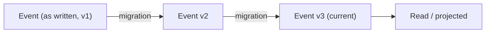

# Migrations

Every system evolves. Business rules change, data models improve, and properties get renamed, split, or combined. In event-sourced systems this creates a challenge: events are immutable facts, and the historical record cannot simply be edited. Chronicle solves this with a declarative migration system that lets you evolve event schemas without losing backward compatibility.



## Why migrations?

Events in Chronicle represent things that happened, not the current state. That immutability is a feature — it gives you a reliable audit trail and the ability to replay history. But it also means you need a principled way to handle changes to event schemas over time.

Chronicle's migration system addresses this through **generations**. Each version of an event type is a distinct generation. When you introduce a new generation, you declare how to transform events between that generation and its predecessor in both directions:

- **Upcasting** — transforming an older generation into a newer one (e.g. splitting a `Name` field into `FirstName` and `LastName`)
- **Downcasting** — transforming a newer generation back into an older one (e.g. recombining `FirstName` and `LastName` into `Name`)

## Architecture: Kernel-side migrations

**Migrations are a Kernel concern, not a client concern.** The Chronicle Kernel evaluates and applies migrations regardless of whether a client is connected. This is a fundamental design principle:

- Migrations run during event append inside the Kernel
- The Kernel stores every generation of an event simultaneously
- No client coordination is required for migrations to take effect
- Clients that are offline or on older code versions are unaffected

This means your migration logic is durable. Once a migrator is registered with the Kernel, it operates on every event that passes through, whether it originated from a .NET client, a REST call, or a future integration you haven't written yet.

## Multi-version storage

When an event with generation migrations arrives at the Kernel, it stores **all generations** of that event, whether appended individually or as part of an `AppendMany` batch:

- Appending a generation 1 event with a 1→2 migration stores gen 1 and gen 2
- Appending a generation 2 event with a 1→2 migration stores gen 2 and the downcasted gen 1
- Appending a generation 3 event with 1→2 and 2→3 migrations stores gen 1, gen 2, and gen 3

This multi-version storage is what makes event-sourced systems with migrations genuinely decoupled. Consider two services that share an event type:

- **Service A** is running the latest code and expects generation 2
- **Service B** is running older code and expects generation 1

Both services read the same event and each gets the generation they expect. There is no negotiation, no shared upgrade schedule, no risk of one service breaking another. The Kernel handles the translation, and each consumer reads the generation it understands.

```text
Append gen 1 event
        │
        ▼
  Kernel receives
        │
        ├── Store gen 1  ─── Service B reads gen 1
        │
        └── Upcast to gen 2
                │
                └── Store gen 2  ─── Service A reads gen 2
```

## Migrations happen in place

Current generation backfills are **add-only**: they produce missing representations alongside stored generations without replacing their content. Events backfilled by earlier releases may already have been overwritten; upgrading cannot recover those originals. SQL revisions also overwrite a generation's content in place, so backfill can preserve only the content still stored there.

This is what makes running multiple versions of the same software against the same event store safe. Service A on the latest code reads generation 2; Service B on the previous release reads generation 1. Both read from the same physical storage. Neither service needs to know about the other, and no upgrade coordination is required.

### Background upcasting for new generations

Registering a new generation automatically starts a background job for that event type in the **default namespace's event log only**. Other namespaces and event sequences are not backfilled by this job.

The source is the known appended generation's base content, never a separate revision. If the appended generation is unknown, the job uses the highest stored base generation and records it as a derived source; the appended generation stays unknown. Each added generation records its source and the content-addressed migration-definition version that produced it. Content, hash, and provenance are written atomically only if the event has not been concurrently revised, redacted, or populated by another worker.

On a conflict the job re-reads the event and retries once. If the retry also conflicts, it logs and skips that event without failing the step. Already-stored generations remain unchanged, including when migration definitions change. Changing a migration alone does not start another backfill.

Register new generations **only after every kernel silo has been upgraded**. New jobs use add-only workers and legacy jobs resumed on upgraded silos delegate to add-only backfill, but workers still running an older release can overwrite content during the rollout.

## Topics

- [C# client usage](dotnet-client)
