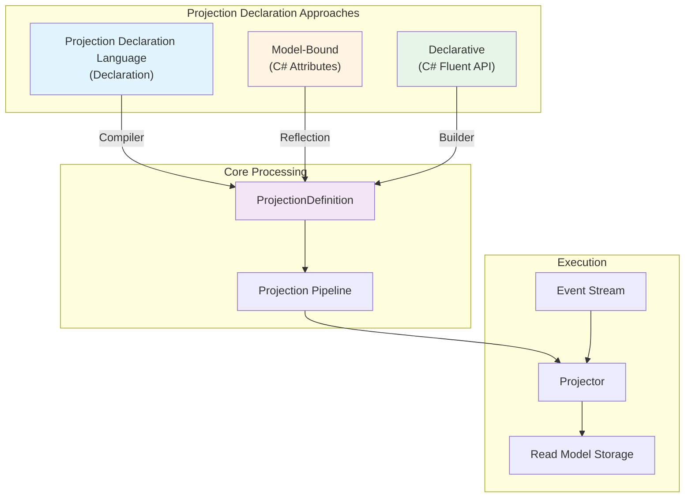
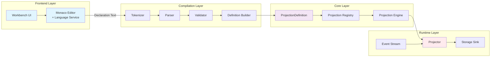
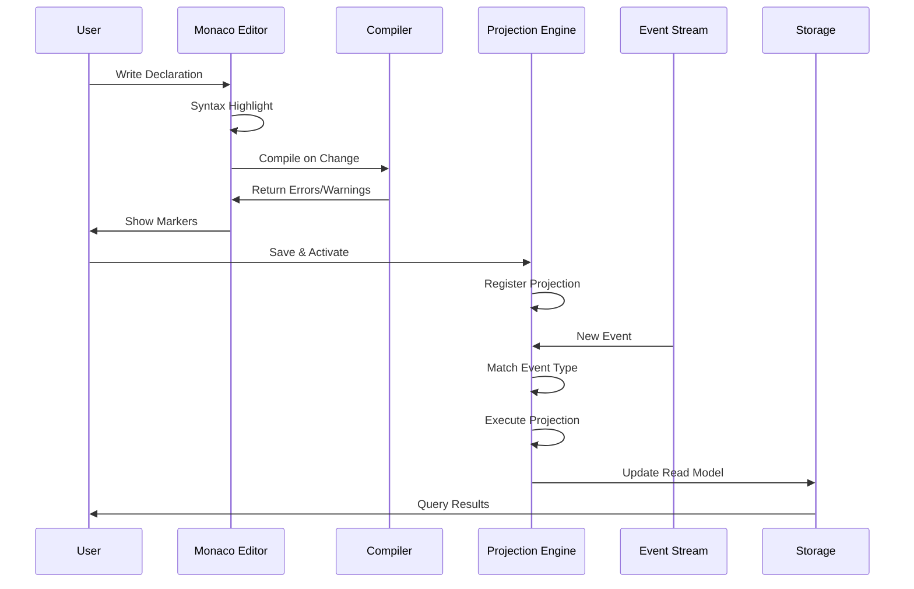

# Projection Architecture

Chronicle supports three distinct approaches for defining projections, each designed for different use cases and developer preferences. This page explains the architecture and how these approaches work together.

## Three Projection Approaches



### 1. Projection Declaration Language

The Projection Declaration Language provides a concise, indentation-based syntax optimized for readability and quick authoring.
Typically available from the tooling like Workbench.

**Example:**
```
projection MyModel
    from MyEvent
        set name = $.eventProperty
        set count = $count + 1
```

**Benefits:**
- Minimal syntax and ceremony
- Easy to read and understand
- Fast iteration with live preview
- Context-sensitive auto-completion in editors

**Use when:**
- Building new projections
- Prototyping and experimentation
- Working with the Workbench UI
- Team prefers concise, declarative syntax

### 2. Model-Bound Projections

Model-bound projections use C# attributes on your read model classes, keeping the projection logic close to the data structure.

**Example:**
```csharp
[Projection("MyModel")]
public record MyModel
{
    [From<MyEvent>]
    [Set("name", "$name")]
    public string Name { get; init; }

    [From<MyEvent>]
    [Count]
    public int Count { get; init; }
}
```

**Benefits:**
- Type-safe at compile time
- Co-located with read model definition
- Leverages C# tooling and IntelliSense
- Natural for C# developers

**Use when:**
- Strong type safety is required
- Using C#-first development workflow
- Read model and projection logic should be together
- Refactoring tools are important

### 3. Declarative Projections

Declarative projections use a fluent C# API to define projections programmatically with maximum flexibility.

**Example:**
```csharp
public class MyModelProjection : IProjectionDefinition
{
    public void Define(IProjectionBuilder<MyModel> builder)
    {
        builder
            .From<MyEvent>()
            .Set(m => m.Name, e => e.EventProperty)
            .Count(m => m.Count);
    }
}
```

**Benefits:**
- Full programmatic control
- Complex conditional logic
- Dynamic projection generation
- Maximum flexibility

**Use when:**
- Complex business rules require code
- Generating projections dynamically
- Advanced scenarios beyond declaration language capabilities
- Need for custom extensions

## Architecture Components



### Frontend Layer

**Workbench UI**: Web-based interface for creating, editing, and testing projections.

**Monaco Editor with Language Service**: Provides rich editing experience with:
- Syntax highlighting for all declaration keywords
- Context-sensitive auto-completion
- Real-time validation with schema awareness
- Hover documentation
- Error markers

### Compilation Layer

**Tokenizer**: Converts declaration text into tokens, handling:
- Indentation-based structure
- Keywords and identifiers
- String literals and expressions
- Line and column tracking (1-based)

**Parser**: Builds an Abstract Syntax Tree (AST) from tokens:
- Validates structure and grammar
- Detects syntax errors with precise locations
- Handles nested blocks (children, joins, composite keys)
- Supports expression parsing

**Validator**: Performs semantic validation:
- Checks event types exist
- Validates property names against schemas
- Ensures composite key types are objects
- Verifies expression syntax

**Definition Builder**: Constructs the final `ProjectionDefinition` object that all three approaches produce.

### Core Layer

**ProjectionDefinition**: Unified representation of projection logic, regardless of source (Projection Declaration, Model-Bound, or Declarative).

**Projection Registry**: Manages all registered projections in the system.

**Projection Engine**: Coordinates projection execution, handles event replay, and manages state.

### Runtime Layer

**Event Stream**: Source of events to be projected.

**Projector**: Executes projection logic for each event:
- Applies transformations
- Manages read model instances
- Handles keys and lookups
- Performs joins and child operations

**Storage Sink**: Persists read models (typically MongoDB or another database).

## Data Flow



## Choosing an Approach

| Criterion | Declaration | Model-Bound | Declarative |
|-----------|-------------|-------------|-------------|
| **Ease of Learning** | ⭐⭐⭐⭐⭐ | ⭐⭐⭐⭐ | ⭐⭐⭐ |
| **Type Safety** | ⭐⭐ | ⭐⭐⭐⭐⭐ | ⭐⭐⭐⭐⭐ |
| **Conciseness** | ⭐⭐⭐⭐⭐ | ⭐⭐⭐ | ⭐⭐⭐ |
| **Flexibility** | ⭐⭐⭐ | ⭐⭐⭐ | ⭐⭐⭐⭐⭐ |
| **Refactoring Support** | ⭐⭐ | ⭐⭐⭐⭐⭐ | ⭐⭐⭐⭐⭐ |
| **Prototyping Speed** | ⭐⭐⭐⭐⭐ | ⭐⭐⭐ | ⭐⭐ |
| **Complex Logic** | ⭐⭐ | ⭐⭐⭐ | ⭐⭐⭐⭐⭐ |

**Recommendation**: Start with the **Projection Declaration Language** for rapid development and prototyping. Move to **Model-Bound** when type safety becomes critical. Use **Declarative** for advanced scenarios requiring programmatic control.

## Common Patterns Across All Approaches

Regardless of which approach you choose, all projections share these concepts:

- **Event Types**: Define which events trigger the projection
- **Keys**: Identify read model instances
- **Property Mappings**: Transform event data to read model properties
- **Joins**: Link to other read models
- **Children**: Model parent-child relationships
- **Filters**: Conditionally process events
- **Operations**: Set, increment, decrement, count, add, subtract

All three approaches compile down to the same `ProjectionDefinition` format, ensuring consistent behavior and performance.
