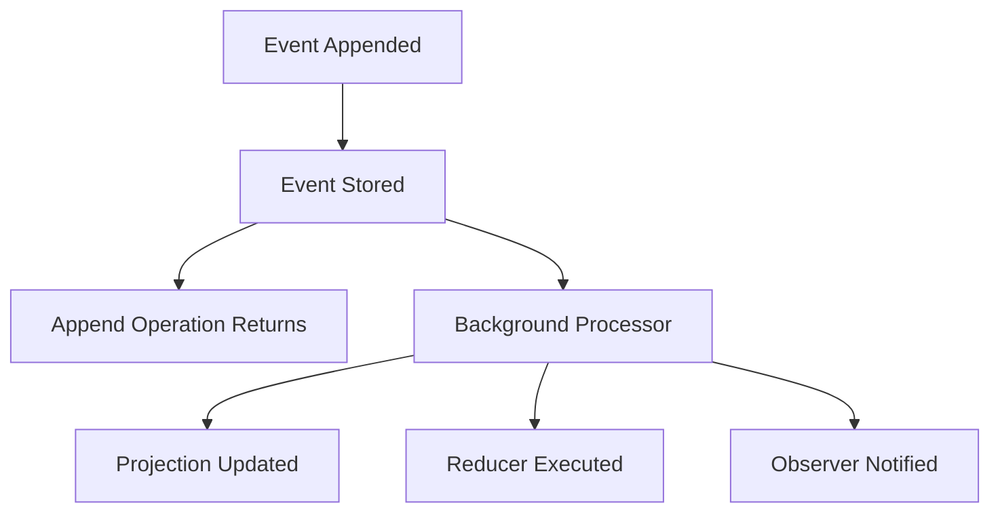

# Eventual Consistency in Projections

Projections in Chronicle operate under the principle of **eventual consistency**, meaning that read models are updated asynchronously as events are processed. This design provides significant performance benefits but requires understanding of how and when data becomes consistent.

## Understanding Eventual Consistency

When you append an event to Chronicle, the following sequence occurs:

1. **Event is persisted** to the event store immediately
2. **Event append operation returns** successfully to the caller
3. **Projections are updated asynchronously** in the background
4. **Read models become consistent** after processing completes

This means there's a brief window where:

- The event has been successfully stored
- But projections may not yet reflect the changes

## Asynchronous Processing

Chronicle processes events for projections asynchronously to ensure optimal performance and scalability:

### Processing Pipeline



### Benefits of Asynchronous Processing

- **High Throughput**: Event appends don't wait for projection updates
- **Scalability**: Projection processing can be scaled independently
- **Resilience**: Failed projection updates don't affect event persistence
- **Performance**: Read and write operations are optimized separately

## Consistency Guarantees

### What Chronicle Guarantees

- **Event Ordering**: Events for the same event source are processed in order
- **At-Least-Once Processing**: Every event will be processed (with retries on failure)
- **Partition Consistency**: All projections for a single event source will be eventually consistent

### What Chronicle Does NOT Guarantee

- **Immediate Consistency**: Projections may lag behind events
- **Cross-Partition Ordering**: Events from different event sources may be processed out of relative order
- **Synchronous Updates**: Projection updates are always asynchronous

## Handling Eventual Consistency

### 1. Design for Asynchronous Updates

Structure your application to work naturally with eventual consistency:

```csharp
// ✅ Good - Fire and forget pattern
public async Task<IActionResult> CreateBook(CreateBookCommand command)
{
    await eventLog.Append(bookId, new BookCreated(command.Title, command.Author));

    // Return immediately - don't wait for projections
    return Ok(new { BookId = bookId });
}

// ❌ Problematic - Expecting immediate consistency
public async Task<IActionResult> CreateBookAndReturn(CreateBookCommand command)
{
    await eventLog.Append(bookId, new BookCreated(command.Title, command.Author));

    // This might return null due to eventual consistency
    var book = await readModels.GetBook(bookId);
    return Ok(book);
}
```

### 2. Watch Projection Changes

Chronicle provides a `.Watch<TReadModel>()` API that allows you to observe projection changes in real-time:

```csharp
public class BookService
{
    private readonly IEventStore _eventStore;

    public BookService(IEventStore eventStore)
    {
        _eventStore = eventStore;
    }

    public IObservable<ProjectionChangeset<BookInventory>> WatchBookChanges()
    {
        // Subscribe to all changes for BookInventory projections
        return _eventStore.Projections.Watch<BookInventory>();
    }

    public async Task CreateBookAndWatch(CreateBookCommand command)
    {
        // 1. Append event
        await _eventStore.EventLog.Append(command.BookId, new BookCreated(command.Title, command.Author));

        // 2. Subscribe to changes (will be notified when projection is updated)
        var subscription = _eventStore.Projections.Watch<BookInventory>()
            .Where(changeset => changeset.ReadModelKey == command.BookId)
            .Subscribe(changeset =>
            {
                // React to the projection update
                Console.WriteLine($"Book projection updated: {changeset.ReadModel?.Title}");
            });
    }
}
```

### 3. Monitor Database Changes

For applications that need to respond to database changes from external sources, you can:

- **Use database change streams**: Most modern databases (MongoDB, PostgreSQL, SQL Server) provide change stream APIs
- **Implement polling mechanisms**: Periodically check for changes using timestamps or version fields
- **Leverage Chronicle's watch API**: Use the `.Watch<TReadModel>()` method to observe projection updates regardless of their source

### 4. Use Command-Query Segregation

Separate operations that create data from those that read data:

```csharp
// Commands - Fire and forget
public class BookCommandHandler
{
    public async Task Handle(CreateBook command)
    {
        await eventStore.Append(command.BookId, new BookCreated(command.Title));
        // Don't return book data here
    }
}

// Queries - Read from projections
public class BookQueryHandler
{
    public async Task<Book> Handle(GetBook query)
    {
        return await readModels.GetBook(query.BookId);
    }
}
```

## Best Practices

### 1. Design for Eventual Consistency

- Accept that reads may be slightly stale
- Use optimistic UI updates where possible
- Implement retry logic for critical consistency requirements

### 2. Test Eventual Consistency Scenarios

- Test your application behavior during projection lag
- Verify retry mechanisms work correctly
- Ensure UI handles missing data gracefully

## Summary

Eventual consistency in Chronicle projections provides excellent performance and scalability while requiring thoughtful application design. By understanding the asynchronous nature of projection updates and implementing appropriate patterns, you can build robust applications that work naturally with Chronicle's event-driven architecture.

Remember: eventual consistency is a feature, not a limitation. It enables the high-performance, scalable systems that Chronicle is designed to support.
