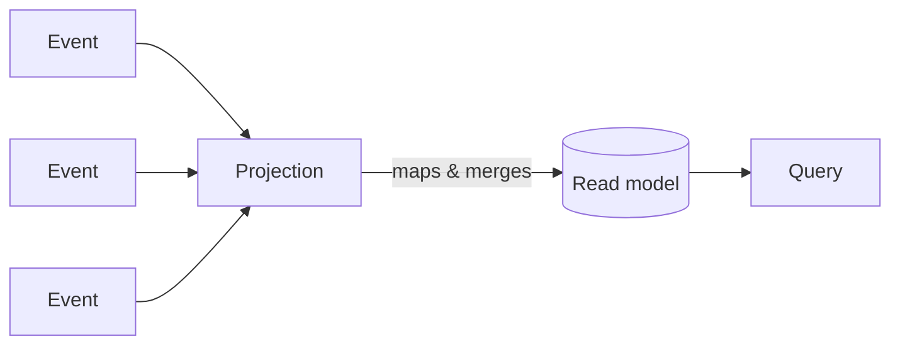

# Projections

Your events are the source of truth, but events are a poor thing to *read* — nobody wants to replay a
thousand `MoneyDeposited` facts to show an account balance. A **projection** does that folding for you:
it watches a stream of events and continuously builds a **read model** — a shaped, queryable view that's
ready to serve to a UI.

The win is specialization. The same events can feed *many* projections, each tailored to one screen or
question: a balance, a transaction list, a monthly summary. You never reuse one bloated model across
conflicting needs — you build a focused read model per view, and each stays simple, fast, and
independent.

## How you'll define one

Projections join **events** (never other read models), and mapping is automatic by default — name a
read model property the same as an event property and it just maps. You have two styles:

| Style | What it looks like | Reach for it when |
| --- | --- | --- |
| [Model-bound](model-bound/index.md) | Attributes on the read model record (`[FromEvent<T>]`, `[Key]`, `[ChildrenFrom<T>]`) | **The default.** Most projections — it's the least boilerplate and reads as the model itself. |
| [Declarative](declarative/index.md) | A fluent `IProjectionFor<T>` definition | The mapping needs logic the attributes can't express cleanly. |

## Choose your consistency

The one decision worth making up front is *when* the read model has to be correct:

| | [Eventual](eventual-consistency.md) | [Immediate](immediate-projections.md) |
| --- | --- | --- |
| **When it updates** | Shortly after the event is appended (the default) | Synchronously, before the append returns |
| **Cost** | Cheap, scales freely | More expensive — pay only when you need it |
| **Use it for** | Almost everything — lists, dashboards, history | A value you must read back correctly *right now* (e.g. a uniqueness check) |

Start eventual. Promote a projection to immediate only when a workflow genuinely can't tolerate the
read model being a moment behind.

## Topics

| Topic | Description |
| ------ | ----------- |
| [Architecture](architecture.md) | How the projection engine turns events into read models |
| [Model-Bound Projections](model-bound/index.md) | Build read models with attributes — the default style |
| [Declarative Projections](declarative/index.md) | Build read models with the fluent `IProjectionFor<T>` API |
| [Immediate Projections](immediate-projections.md) | Strong consistency — the read model updates before the append returns |
| [Eventual Consistency](eventual-consistency.md) | The default — how and when eventual projections catch up |
| [Tagging Projections](tagging-projections.md) | Organize and tag projections |
| [Appended event metadata filters](../events/filtering/index.md) | How tags and metadata correlate reducers and reactors that run alongside projections |

Once your read model exists, expose it to the frontend with a [query](../read-models/index.md) — or see
the whole loop in [Build a full-stack feature](/build-a-full-app/).
