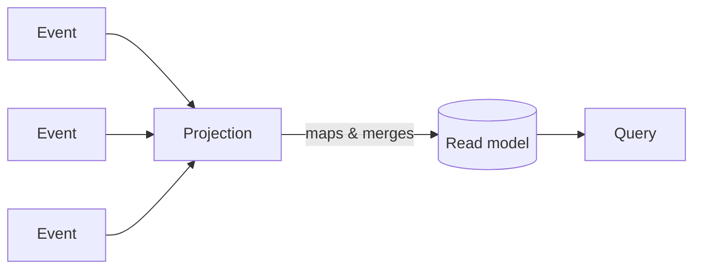

Your events are the source of truth, but events are a poor thing to *read* — nobody wants to replay a
thousand `MoneyDeposited` facts to show an account balance. A **projection** does that folding for you:
it watches a stream of events and continuously builds a **read model** — a shaped, queryable view that's
ready to serve to a UI.

The win is specialization. The same events can feed *many* projections, each tailored to one screen or
question: a balance, a transaction list, a monthly summary. You never reuse one bloated model across
conflicting needs — you build a focused read model per view, and each stays simple, fast, and
independent.

```mermaid
flowchart LR
    E1[Event] --> P[Projection]
    E2[Event] --> P
    E3[Event] --> P
    P -->|maps & merges| RM[(Read model)]
    RM --> Q[Query]
```

## How you'll define one

Projections join **events** (never other read models), and mapping is automatic by default — name a
read model property the same as an event property and it just maps. For a read model backed by events,
you usually choose between three styles:

| Style | What it looks like | Reach for it when |
| --- | --- | --- |
| [Model-bound](model-bound/) | Attributes on the read model record (`[FromEvent<T>]`, `[Key]`, `[ChildrenFrom<T>]`) | **The default.** Most projections — it's the least boilerplate and reads as the model itself. |
| [Declarative](declarative/) | A fluent `IProjectionFor<T>` definition | The mapping needs logic the attributes can't express cleanly. |
| [Reducer](/chronicle/reducers/) | An `IReducerFor<T>` that receives the event, current state, and event context | The read model is easier to express as state transitions or calculations over previous state. |

[Choose a read-model style](choosing-a-read-model-style) builds the same read model as a
model-bound projection, a declarative projection, and a reducer so the trade-offs are visible side by
side.

## Choose your consistency

The one decision worth making up front is *when* the read model has to be correct:

| | [Materialized (eventual)](eventual-consistency) | [Passive (on demand)](declarative/passive.mdx) |
| --- | --- | --- |
| **When it updates** | Shortly after the event is appended (the default) | Never stored — computed from its events each time you read it |
| **Cost** | Cheap reads, scales freely | Each read replays that instance's history |
| **Use it for** | Almost everything — lists, dashboards, history | A value you must read back correctly *right now*, such as state a command decides on |

Start materialized. Make a read model passive only when a workflow genuinely can't tolerate it being a
moment behind. When one caller occasionally needs its own write back, it can instead
[wait for the append's observers](../read-models/consistency.md#read-after-write--waiting-for-a-materialized-read-model).
No projection updates synchronously inside the append, and a read cannot enforce uniqueness — use a
[constraint](../constraints/index.md) for that.

## Topics

| Topic | Description |
| ------ | ----------- |
| [Architecture](architecture) | How the projection engine turns events into read models |
| [Choose a read-model style](choosing-a-read-model-style) | Compare model-bound, declarative, and reducer approaches on the same read model |
| [Model-Bound Projections](model-bound/) | Build read models with attributes — the default style |
| [Declarative Projections](declarative/) | Build read models with the fluent `IProjectionFor<T>` API |
| [Immediate Projections](immediate-projections.md) | Why there is no synchronous projection mode, and what to use instead |
| [Eventual Consistency](eventual-consistency) | The default — how and when eventual projections catch up |
| [Registration lifecycle](registration-lifecycle.md) | What happens when projections register, change, fail, or are no longer declared |
| [Tagging Projections](tagging-projections) | Organize and tag projections |
| [Appended event metadata filters](../events/filtering/index.md) | How tags and metadata correlate reducers and reactors that run alongside projections |

Once your read model exists, expose it to the frontend with a [query](../read-models/index.md) — or see
the whole loop in [Build a full-stack feature](/build-a-full-app/).
