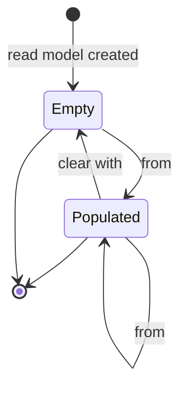
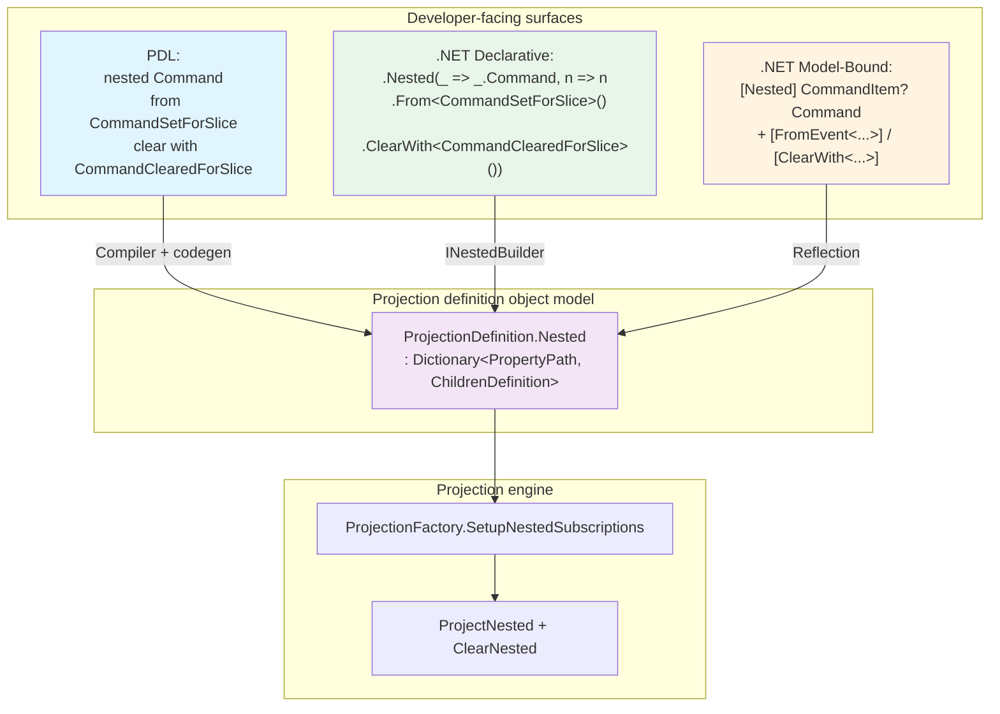

# Nested Projection Objects — Design

This page is the cross-cutting design reference for **nested projection objects** — the ability to populate, update, and clear a single nullable child object on a read model from events. It is an explanation-style page that ties together every layer affected by the feature: the [Projection Declaration Language (PDL)](projection-declaration-language/nested.md) syntax, the [declarative .NET client](declarative/nested.md), the [model-bound .NET client](model-bound/nested.md), the projection definition object model, the projection engine, the PDL compiler and code generator, and the Monaco language definition for the Workbench projection editor.

The user-facing references for each surface live in their respective folders. This page exists to explain *what `nested` means as a concept*, *why it is a first-class projection primitive*, *how the moving parts fit together*, and *what remains to be done*.

> Tracking issue: [Cratis/Chronicle#3142](https://github.com/Cratis/Chronicle/issues/3142).

## Motivation

A read model frequently has properties that represent a single, optional, scalar child object — for example, the *active* contract on an employee, the *current* promotion on a product, or the *registered* command for a slice. These properties have three distinct behaviors:

1. They start out as `null`.
2. A specific event populates them with a fresh nested object.
3. A specific event clears them back to `null`.

Until nested objects existed as a first-class concept, you had to either:

- Model the property as a collection of one item using [children](declarative/children.md), which forces a key, breaks the scalar nature of the property, and complicates queries; or
- Hand-roll mutations into mapped properties on the parent type, which leaks nested concerns into the root read model and loses any independent lifecycle.

`nested` solves both problems with a small, dedicated primitive that mirrors the shape of [children](declarative/children.md) without the collection semantics — one scalar, nullable property, with explicit set and clear lifecycle events.

## The `nested` concept

A nested object is:

- **A nullable, scalar property** on a read model — it holds at most one child object at a time.
- **Set by one or more events** declared with `from <EventType>`. Each `from` event auto-maps (or explicitly maps) properties onto the nested object, creating it on first touch and merging into the existing instance on subsequent touches.
- **Cleared by one or more events** declared with `clear with <EventType>`. When the clear event fires the property is set back to `null`.
- **Recursive** — a nested object can itself contain children, joins, counters, every-blocks, and further nested objects. Every projection primitive that works at the root works inside a `nested` block.



The contract is intentionally narrow: nested is *not* a soft-deletion marker for the parent, and it is *not* a workaround for one-of-many relationships — use [children](declarative/children.md) for those.

## How the surfaces compose

The four developer-facing surfaces of Chronicle all express the same underlying concept and compile down to the same projection definition.



### PDL syntax

A `nested` block is declared with a property name and contains the same building blocks as a top-level projection or a `children` block:

```pdl
projection Slice => SliceReadModel
  from SliceCreated
    Name = name

  nested command
    from CommandSetForSlice
      Name = commandName
      Schema = schema
    clear with CommandClearedForSlice
```

Two new keywords are introduced: `nested` (block opener) and `clear with` (lifecycle directive). Both can appear inside `children` and inside other `nested` blocks. See [PDL Nested Objects](projection-declaration-language/nested.md) for the full surface.

### Declarative .NET client

The fluent builder exposes `Nested(...)` symmetrical to `Children(...)`, taking a property expression and a configuration callback. The callback receives an `INestedBuilder<TParent, TNested>` that inherits every method of the root projection builder and adds `ClearWith<TEvent>()`:

```csharp
public class SliceProjection : IProjectionFor<Slice>
{
    public void Define(IProjectionBuilderFor<Slice> builder) => builder
        .From<SliceCreated>()
        .Nested(_ => _.Command, nested => nested
            .From<CommandSetForSlice>()
            .ClearWith<CommandClearedForSlice>());
}
```

See [Declarative Nested Objects](declarative/nested.md) for the full surface.

### Model-bound .NET client

Two attributes drive the model-bound surface:

- `[Nested]` — placed on a nullable property or record parameter, marks it as a nested object on the parent.
- `[ClearWith<TEvent>]` — placed on the nested type (or its properties), declares the event that nulls the parent's property.

```csharp
public record Slice(
    [Key] SliceId Id,
    string Name,

    [Nested]
    CommandItem? Command);

[FromEvent<CommandSetForSlice>]
[ClearWith<CommandClearedForSlice>]
public record CommandItem(CommandItemId Id, string Name, string Schema);
```

The nested type is scanned for `[FromEvent<T>]`, `[ClearWith<T>]`, `[SetFrom<T>]`, `[AddFrom<T>]`, `[Nested]`, `[ChildrenFrom<T>]`, and the other standard projection annotations. See [Model-Bound Nested Objects](model-bound/nested.md).

### Recursive nesting

A `nested` block can appear inside another `nested` block, inside a `children` block, and inside a child of a child — there is no recursion depth limit imposed by the model. Each layer is rendered into the projection definition as a `ChildrenDefinition` with `IdentifiedBy = PropertyPath.NotSet`, which the engine treats as "scalar" rather than "collection".

```pdl
projection Slice => SliceReadModel
  from SliceCreated
    Name = name

  nested command
    from CommandSetForSlice
      Name = commandName

    nested validation
      from ValidationConfigured
        Rules = rules
      clear with ValidationRemoved

    clear with CommandClearedForSlice
```

```csharp
public record Slice(
    [Nested] CommandItem? Command);

[FromEvent<CommandSetForSlice>]
[ClearWith<CommandClearedForSlice>]
public record CommandItem(
    string Name,
    [Nested] ValidationConfig? Validation);

[FromEvent<ValidationConfigured>]
[ClearWith<ValidationRemoved>]
public record ValidationConfig(string Rules);
```

### Nested within children

A `nested` block may also live inside a [children](declarative/children.md) collection, attaching a single nullable child object to every item in the collection. The engine resolves the property path with the child's array indexers so each item maintains its own nested state:

```pdl
projection Project => ProjectReadModel
  from ProjectCreated
    Name = name

  children tasks identified by taskId
    from TaskAdded key taskId
      parent projectId
      Title = title

    nested assignee
      from TaskAssigned
        Name = assigneeName
        Email = assigneeEmail
      clear with TaskUnassigned
```

## Object model

Nested objects are represented in the contract layer by reusing `ChildrenDefinition` — the same shape that drives collections — with a sentinel `IdentifiedBy` value:

| Field | Children | Nested |
|---|---|---|
| `IdentifiedBy` | An event property path that keys the collection | `PropertyPath.NotSet` |
| `From` | Events that add or update items | Events that set or update the scalar |
| `RemovedWith` | Events that remove a single item | Events that clear the scalar to `null` |
| `Children` | Nested collections within items | Nested collections within the scalar |
| `Nested` | Nested scalars within items | Nested scalars within the scalar |

`ProjectionDefinition.Nested` and `ChildrenDefinition.Nested` are dictionaries keyed by the property path of the nested object on the parent. The engine walks this structure recursively to build subscriptions.

## Engine

`ProjectionFactory.SetupNestedSubscriptions` walks the `Nested` dictionaries of a projection definition, prefixing every property path with the accumulated path to the current nested or child position. For each entry it:

1. Resolves the merged property mappers using the schema of the parent and the events.
2. Subscribes each `from` event to the engine's `ProjectNested` operator, which writes the mapped properties onto the nested object (creating it if it doesn't yet exist).
3. Subscribes each `clear with` event to `ClearNested`, which sets the property back to `null` while preserving the array indexers of any surrounding children.
4. Recurses into the nested definition's own `Nested` dictionary so deeper levels are wired up in the same pass.

The `Changeset` infrastructure already carries the necessary `NestedCleared` change type so sinks can persist the null transition correctly across the MongoDB and SQL storage providers.

## Integration spec scenarios

Integration coverage for nested objects lives under `Integration/DotNET.InProcess/Projections/Scenarios/`:

- `when_projecting_with_nested_object/` — declarative first-level nested
  - `setting_the_nested_object` — populates the nested object from a `from` event
  - `updating_the_nested_object` — multiple `from` events merge into the same nested instance
  - `clearing_the_nested_object` — the `clear with` event nulls the property
- `ModelBound/when_projecting_with_nested_object/` — model-bound first-level nested
  - The same three scenarios driven by `[Nested]` and `[ClearWith<T>]`.
- `ModelBound/when_projecting_with_nested_in_children/` — nested object inside a children collection.

Additional recursive (2-level) scenarios are tracked as future work — see [Remaining work](#remaining-work) below.

## Implementation status

| Area | Status |
|---|---|
| `nested` concept on the projection definition object model | Implemented |
| Projection engine — `ProjectNested`, `ClearNested`, `SetupNestedSubscriptions` | Implemented |
| Declarative .NET client — `INestedBuilder<TParent, TNested>`, `.Nested(...)`, `.ClearWith<TEvent>()` | Implemented |
| Model-bound .NET client — `[Nested]`, `[ClearWith<TEvent>]` | Implemented |
| Storage sinks — `NestedCleared` change handling for MongoDB and SQL | Implemented |
| Integration specs — first-level nested (declarative + model-bound) | Implemented |
| Integration specs — nested inside children | Implemented |
| Documentation — declarative, model-bound, PDL reference pages | Implemented |
| Integration specs — recursive (2-level) nested-in-nested | Outstanding |
| PDL compiler — `nested` and `clear with` parsing rules | Outstanding |
| PDL grammar reference (EBNF) — `nested` and `clear with` productions | Outstanding |
| PDL code generator — emit `Nested` entries onto `ProjectionDefinition` | Outstanding |
| Monaco language definition — `nested`, `clear`, `with` keywords | Outstanding |

## Remaining work

The remaining work is bounded to the surfaces that bridge user-authored PDL to the projection definition object model, plus an additional pass of integration coverage. None of this work changes the runtime engine or the .NET client APIs that are already in place.

### Phase 1 — Recursive integration spec

Add a `when_projecting_with_nested_in_nested/` folder under `Integration/DotNET.InProcess/Projections/Scenarios/` covering:

- Set the outer nested object from an event.
- Set the inner nested object from a separate event.
- Update the inner nested object.
- Clear the inner nested object — leaves the outer object intact.
- Clear the outer nested object — also discards the inner object.

Mirror the same three behaviors under `ModelBound/when_projecting_with_nested_in_nested/`.

### Phase 2 — Monaco grammar

Extend the Workbench Monaco language definition with the missing keywords so that editors highlight and indent `nested` blocks correctly:

- Add `nested` and `clear` to the keyword list.
- Update the indentation pattern to treat `nested` as a block opener (analogous to `children`).
- Update the folding marker pattern to fold `nested` blocks.

The `with` keyword already exists from the `remove with` and `join` constructs and does not need to be added.

### Phase 3 — PDL compiler

Extend the PDL parser with two new productions:

```ebnf
NestedBlock     = "nested", Ident, NL,
                  INDENT,
                    { ProjDirective | Block | NestedBlock | ClearWithBlock },
                  DEDENT ;

ClearWithBlock  = "clear", "with", TypeRef, NL ;
```

Update `Block` and `ChildBlock` to include `NestedBlock`, and update `FromEventBlock` (or introduce a dedicated nested-from variant) to allow appearing inside a `NestedBlock`. The compiler should reject `nested` blocks that omit at least one `from`, just as it rejects empty `children` blocks today.

Update [Grammar (EBNF)](projection-declaration-language/grammar.md) to reflect the new productions.

### Phase 4 — PDL code generator

Update the code generator so that each `NestedBlock` emits a corresponding entry in `ProjectionDefinition.Nested` (or `ChildrenDefinition.Nested` for nested blocks inside children). The generated entry must:

- Set `IdentifiedBy = PropertyPath.NotSet` so the engine treats the block as scalar.
- Carry the `from` events as `From` entries.
- Carry the `clear with` events as `RemovedWith` entries.
- Recursively emit inner `children` and `nested` blocks into the dictionary fields.

### Phase 5 — End-to-end verification

Once the compiler and code generator land, add a PDL → engine integration spec that takes a PDL document containing `nested` and verifies the same observable outcomes as the declarative spec already verifies.

## Open design questions

- **Empty `nested` blocks.** Should the PDL compiler accept a `nested` block with only `clear with` and no `from`, or reject it as ambiguous? The declarative and model-bound clients let you forget the clear; symmetry would suggest the same flexibility for the set side, but the resulting nested object would have no events to populate it.
- **Mapping inheritance.** Should `every` blocks at the parent level apply to nested objects by default, or require an explicit opt-in? The engine currently does not propagate `every` into nested scopes; making this explicit in PDL would prevent surprise behavior.
- **Removal cascade ordering.** When the outer object is cleared, does the inner nested object emit its own `clear with` event semantics on the sink (separate `NestedCleared` per level), or does the outer clear discard the entire subtree as one change? The current implementation cascades structurally — open question whether downstream sinks need a more granular signal.
- **Schema discovery.** The model-bound discovery walks `[Nested]` properties using reflection. There is an open question about how to surface diagnostics when a `[ClearWith<T>]` attribute references an event type that no `[FromEvent<T>]` on the nested type produces — should the framework warn at startup or be silent?

## See also

- [PDL — Nested Objects](projection-declaration-language/nested.md)
- [Declarative — Nested Objects](declarative/nested.md)
- [Model-Bound — Nested Objects](model-bound/nested.md)
- [Children](declarative/children.md)
- [Projection Architecture](architecture.md)
