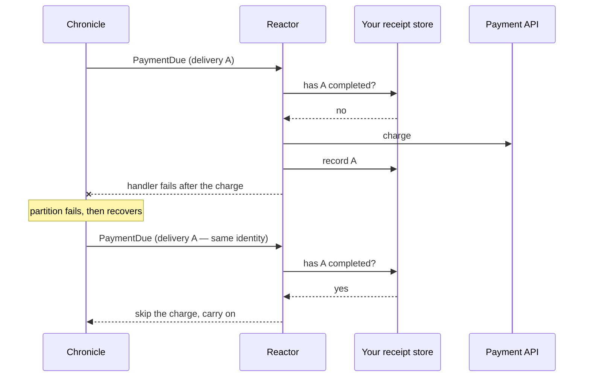

# Delivery identity

A reactor can be handed the same event more than once, and nothing in the event itself says whether this is the
first time. Declare a `ReactorDelivery` parameter on a handler method and Chronicle gives you a stable identity
for *this delivery of this event to this reactor* — the same value every time the event comes back, and a
different value for every genuinely different delivery.

<ChronicleClientTabs snippet="reactors/delivery-identity/basic" />

`delivery.Id` is the key. Record it when the side effect completes, check it before doing the side effect again.

## Why the existing markers are not enough

[OnceOnly](once-only) and [Replay](replay) both act on **replay** — the deliberate re-delivery you trigger by
rewinding an observer, or that a redaction or revision triggers for you. Neither one touches the other reason an
event comes back: your handler failed part-way through, the event-source partition paused, and recovering that
partition re-delivers the event as an ordinary observation. That is not a replay, so `OnceOnly` does not suppress
it — nor should it, since re-running the handler is the entire point of a retry. But if the handler had already
charged the card before it failed, the retry charges it again (see
[Troubleshooting](../troubleshooting/index.md) for the symptom, and
[Observers](../hosting/configuration/observers.md) for how retries and quarantine are configured).

The delivery identity is the seam for that case. It is the same across the failure and the recovery, so a record
you keep under it survives the retry.

## How the three relate

| Mechanism | Covers replay | Covers recovery after a failure | Needs storage |
|---|---|---|---|
| `[OnceOnly]` | Yes — the handler is skipped | No | No |
| `[Replay]` | Yes — a different handler takes over | No | No |
| `ReactorDelivery` | Yes — a replay repeats the same delivery, so the identity matches | Yes | Yes — yours |

They compose rather than compete. Reach for `[OnceOnly]` or `[Replay]` first: they are declarative, cost nothing,
and cover replay completely. Add the delivery identity when the side effect must also survive a partition failure,
and keep the marker — `[OnceOnly]` then spares you a storage round-trip on every replayed event, and the receipt
covers the retries the marker cannot see.

<ChronicleClientTabs snippet="reactors/delivery-identity/with-once-only" />

## What counts as the same delivery

The identity is built from six things Chronicle already knows, and nothing else:

| Component | What it is |
|---|---|
| `Reactor` | The reactor the event is delivered to |
| `EventStore` | The event store the event belongs to |
| `Namespace` | The namespace within that event store |
| `EventSequence` | The event sequence the reactor observes — the event log, or an inbox |
| `Partition` | The event source id the event is observed under |
| `SequenceNumber` | The event's position in the event sequence |

Two deliveries agreeing on all six are the same delivery; differing on any one of them makes them different. There
is deliberately nothing in there about *why* the event arrived, so a replay and the live delivery it repeats share
one identity. If a handler needs to know why, take an `EventContext` alongside and read its `ObservationState`.

`ReactorDelivery` is a record, so you can compare two of them directly. `delivery.Id` renders the same components
as a single string for use as a storage key.

:::caution[The identity is a persisted key]
Once you store receipts under `delivery.Id`, that string is part of your data. Renaming a reactor type without
giving it a stable id via `[Reactor("...")]`, moving a reactor to a different event sequence, or renaming a
namespace all change the identity — and every receipt written under the old one stops matching, so the side
effects they covered run again. Give any reactor whose deliveries you record an explicit id.
:::

## What it does and does not guarantee

It is an identity. It is not exactly-once delivery, and it does not make your reactor idempotent — it gives you the
one thing you cannot compute yourself, and leaves the rest to you.

- **Chronicle does not know whether your side effect ran.** It never sees your payment API or your mail server, so
  it cannot suppress a repeat on your behalf. Nothing is skipped unless your own code skips it.
- **Chronicle stores no receipt.** There is no framework-managed table of completed deliveries, no retention
  policy to configure, and no state added to your event store. The record is yours to write, index, and expire.
- **The gap between the effect and the record is still a gap.** Charge the card, die before writing the receipt,
  and the retry charges again. Recording the identity narrows at-least-once towards at-most-once exactly
  as far as your record is atomic with the effect — write both in one database transaction and the gap closes;
  call a remote API and it does not. Where you cannot close it, use the identity as the idempotency key the remote
  API itself accepts, and let it deduplicate.
- **Delivery is still at-least-once.** That is the contract Chronicle offers and this does not change it. The
  identity makes at-least-once *tractable*; it does not replace it.

If the integration you are calling is already idempotent, you do not need any of this — pass `delivery.Id` as its
idempotency key and stop there.

:::note[Client coverage]
`ReactorDelivery` is a .NET client feature. Elixir and TypeScript reactors have no equivalent parameter yet; make
those integrations self-idempotent instead.
:::
