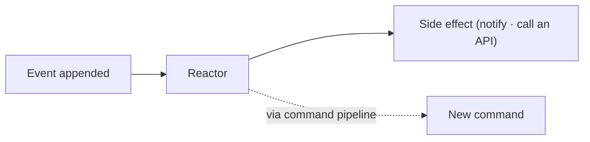

# Reactors

Reactors are observers that react to events and execute side effects. They are ideal for integrating with external systems, sending notifications, or emitting follow-up actions when events occur.



## Key Concepts

- **Event-driven side effects** - Reactors run when events are appended and can call external services or enqueue work
- **Convention-based methods** - Public methods with supported signatures are discovered automatically
- **Event context access** - Optional `EventContext` provides metadata like timestamps and identifiers
- **Event-source isolation** - Events are processed per event source, in order, to keep behavior consistent

## When to Use Reactors

Reactors are a good fit when you need to:

- Trigger notifications or workflows when specific events occur
- Synchronize with external systems
- Run validations or side effects that do not belong in projections or reducers
- Emit follow-up events based on patterns in the event stream

## Basic Example

```csharp
using Cratis.Chronicle.Events;
using Cratis.Chronicle.Reactors;

[EventType]
public record EmailConfirmed(string Email);

public class EmailNotificationsReactor : IReactor
{
    public Task Confirmed(EmailConfirmed @event, EventContext context)
    {
        return SendConfirmationAsync(@event.Email, context.Occurred);
    }

    Task SendConfirmationAsync(string email, DateTimeOffset occurred) => Task.CompletedTask;
}
```

## Topics

- [Getting Started](getting-started.md)
- [Subscribe to External Event Stores](external-event-store-subscriptions.md)
- [Event Processing](event-processing.md)
- [Returning Side Effects](side-effects.md)
- [Event Sequence](event-sequence.md)
- [Once-Only Processing](once-only.md)
- [Filtering by appended event metadata](../events/filtering/index.md)
- [Tagging Reactors](../concepts/tagging-reactors.md)

> Reactors react to **events**. To react instead to a **read model** being added, modified or removed — with the same convention-based methods, dependencies and side effects — see [Reacting to Read Model Changes](../read-models/reacting-to-changes.md).
