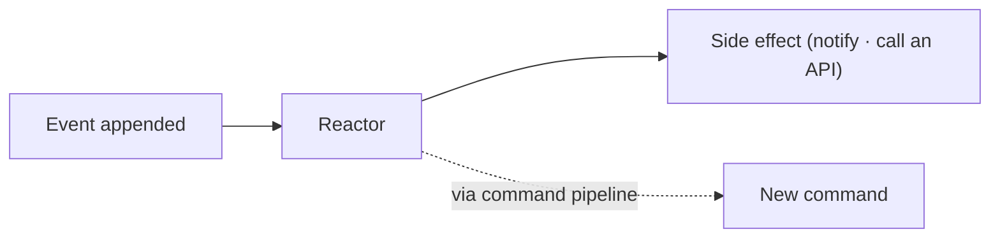

# Reactors

Reactors are observers that react to events and execute side effects. They are ideal for integrating with external systems, sending notifications, or emitting follow-up actions when events occur.

## Key Concepts

- **Event-driven side effects** - Reactors run when events are appended and can call external services or enqueue work
- **Convention-based methods** - Public methods with supported signatures are discovered automatically
- **Event context access** - Optional `EventContext` provides metadata like timestamps and identifiers
- **Event-source isolation** - Events are processed per event source, in order, to keep behavior consistent

## When to Use Reactors

Reactors are a good fit when you need to:

- Trigger notifications or workflows when specific events occur
- Synchronize with external systems
- Run validations or side effects that do not belong in projections or reducers
- Emit follow-up events based on patterns in the event stream

## Basic Example

<ChronicleClientTabs snippet="reactors/index/basic-example" />

## Topics

- [Getting Started](getting-started)
- [Subscribe to External Event Stores](external-event-store-subscriptions)
- [Event Processing](event-processing)
- [Returning Side Effects](side-effects)
- [Event Sequence](event-sequence)
- [Once-Only Processing](once-only)
- [Filtering by appended event metadata](../events/filtering/index.md)
- [Tagging Reactors](../concepts/tagging-reactors)
