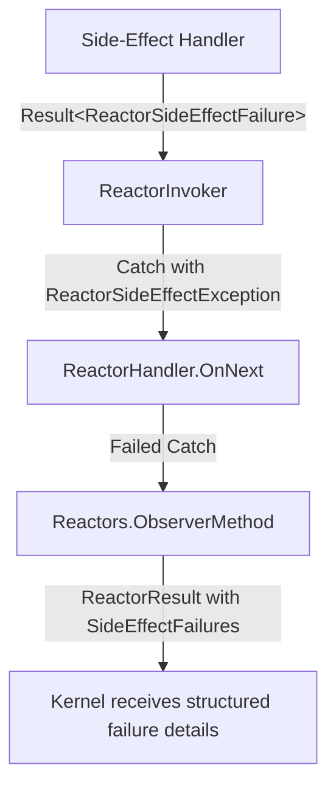

# Returning Side Effects from Reactor Handler Methods

Reactor handler methods can return side-effect events directly instead of taking a dependency on `IEventLog`. The framework automatically appends the returned events to the correct sequence after the handler completes.

> **Important**: If an append operation fails (constraint violation, concurrency violation, or error), the side-effect handler returns a `Result<ReactorSideEffectFailure>` containing the failure details. The reactor partition is marked as failed with structured error information. The partition will be retried according to the observer retry policy.

## Basic Usage

Return a single event directly from a handler method — synchronously or as a `Task<T>`:

```csharp
using Cratis.Chronicle.Events;
using Cratis.Chronicle.Reactors;

public class WarehouseReactor : IReactor
{
    // Synchronous — no async overhead when the result is already available
    public StockDecreased BookReserved(BookReserved @event, EventContext context) =>
        new StockDecreased(@event.Isbn, 1);

    // Asynchronous — use when you need to await something before producing the event
    public async Task<StockDecreased> BookReservedAsync(BookReserved @event, EventContext context)
    {
        var available = await FetchCurrentStockAsync(@event.Isbn);
        return new StockDecreased(@event.Isbn, available);
    }

    Task<int> FetchCurrentStockAsync(string isbn) => Task.FromResult(0);
}
```

The returned event is appended to the event log using the `EventSourceId` from the incoming `EventContext`. No `IEventLog` injection required.

## Multiple Side Effects

Return `IEnumerable<TEvent>` to append several events in one handler call:

```csharp
public IEnumerable<object> BookReserved(BookReserved @event, EventContext context) =>
[
    new StockDecreased(@event.Isbn, 1),
    new StockLow(@event.Isbn),
];
```

## Reactor-Level Metadata Resolution

Set metadata once on the reactor type so every returned event inherits it automatically.

### `ICanProvideEventSourceId`

Implement this interface to supply a custom `EventSourceId` for all side-effect events from this reactor:

```csharp
public class WarehouseReactor : IReactor, ICanProvideEventSourceId
{
    readonly string _warehouseId;

    public WarehouseReactor(string warehouseId) => _warehouseId = warehouseId;

    public EventSourceId GetEventSourceId() => _warehouseId;

    public StockDecreased BookReserved(BookReserved @event, EventContext context) =>
        new StockDecreased(@event.Isbn, 1);
}
```

### `ICanProvideSubject`

Implement this interface to attach a `Subject` (e.g. a user or principal) to appended events:

```csharp
public class OrderReactor : IReactor, ICanProvideSubject
{
    readonly string _userId;

    public OrderReactor(string userId) => _userId = userId;

    public Subject GetSubject() => new Subject(_userId);
}
```

### `ICanProvideEventStreamId`

Implement this interface to specify a runtime `EventStreamId`:

```csharp
public class TenantReactor : IReactor, ICanProvideEventStreamId
{
    readonly string _tenantId;

    public TenantReactor(string tenantId) => _tenantId = tenantId;

    public EventStreamId GetEventStreamId() => _tenantId;
}
```

### `[EventStreamType]` and `[EventSourceType]` Attributes

Apply these attributes to the reactor class for a compile-time stream or source type:

```csharp
[EventStreamType("warehouse")]
[EventSourceType("product")]
public class WarehouseReactor : IReactor
{
    public StockDecreased BookReserved(BookReserved @event, EventContext context) =>
        new StockDecreased(@event.Isbn, 1);
}
```

### Priority Order

| Metadata | Priority |
|---|---|
| `EventSourceId` | `ICanProvideEventSourceId` → `eventContext.EventSourceId` |
| `EventStreamId` | `ICanProvideEventStreamId` → `[EventStreamId]` attribute → `null` |
| `EventStreamType` | `[EventStreamType]` attribute → `null` |
| `EventSourceType` | `[EventSourceType]` attribute → `null` |
| `Subject` | `ICanProvideSubject` → `null` |

## Custom Return Type Handlers

Extend the pipeline by registering a custom `IReactorSideEffectHandler`:

```csharp
public class MyHandler : IReactorSideEffectHandler
{
    public bool CanHandle(ReactorContext reactorContext, object value) =>
        value is MySpecialResult;

    public async Task<Result<ReactorSideEffectFailure>> Handle(ReactorContext reactorContext, IEventStore eventStore, object value)
    {
        // process value
        // Return Result.Success<ReactorSideEffectFailure>() on success
        // Return Result.Failed(failure) on error
        return Result.Success<ReactorSideEffectFailure>();
    }
}

// Register in DI
services.AddSingleton<IReactorSideEffectHandler, MyHandler>();
```

## Supported Return Types

| Return type | Handler invoked |
|---|---|
| `TEvent` | `EventResultHandler` — appends single event |
| `Task<TEvent>` | `EventResultHandler` — appends single event |
| `IEnumerable<TEvent>` | `EventsResultHandler` — appends each event |
| `Task<IEnumerable<TEvent>>` | `EventsResultHandler` |
| `void` / `Task` | No side effects appended |

## Error Handling

When a reactor returns side-effect events, the framework checks the `AppendResult` of each append operation using the `Result<>` monad pattern. If any append fails, the side-effect handler returns a `Result.Failed(ReactorSideEffectFailure)` containing:

- **Constraint violations**: Unique constraint violations with event type and message details
- **Concurrency violations**: Flags indicating version conflicts
- **Errors**: Structured error messages from infrastructure failures

The `Result` propagates through the reactor pipeline as a `ReactorSideEffectException`, which is caught by the observer infrastructure:

1. The partition is marked as failed
2. Full side-effect failure details are serialized into `ReactorResult.SideEffectFailures`
3. Exception messages and stack trace are recorded separately
4. The partition is retried according to the observer retry policy
5. The observer is quarantined if the retry limit is exceeded

This ensures that append failures don't go unnoticed and provides structured error information for debugging through the failed partitions API and kernel observability.

### Architecture Flow



