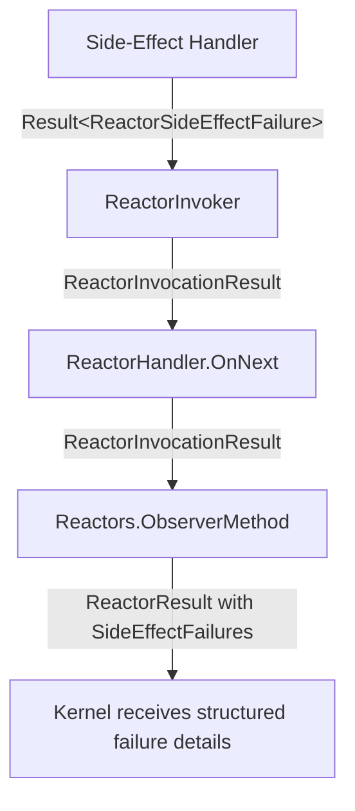

# Returning Side Effects from Reactor Handler Methods

Reactor handler methods can return side-effect events directly instead of taking a dependency on `IEventLog`. The framework automatically appends the returned events to the correct sequence after the handler completes.

> **Important**: If an append operation fails (constraint violation, concurrency violation, or error), the side-effect handler returns a `Result<ReactorSideEffectFailure>` containing the failure details. The reactor partition is marked as failed with structured error information. The partition will be retried according to the observer retry policy.

## Basic Usage

Return a single event directly from a handler method — synchronously or as a `Task<T>`:

```csharp
using Cratis.Chronicle.Events;
using Cratis.Chronicle.Reactors;

public class WarehouseReactor : IReactor
{
    // Synchronous — no async overhead when the result is already available
    public StockDecreased BookReserved(BookReserved @event, EventContext context) =>
        new StockDecreased(@event.Isbn, 1);

    // Asynchronous — use when you need to await something before producing the event
    public async Task<StockDecreased> BookReservedAsync(BookReserved @event, EventContext context)
    {
        var available = await FetchCurrentStockAsync(@event.Isbn);
        return new StockDecreased(@event.Isbn, available);
    }

    Task<int> FetchCurrentStockAsync(string isbn) => Task.FromResult(0);
}
```

The returned event is appended to the event log using the `EventSourceId` from the incoming `EventContext`. No `IEventLog` injection required.

## Multiple Side Effects

Return `IEnumerable<TEvent>` to append several events in one handler call:

```csharp
public IEnumerable<object> BookReserved(BookReserved @event, EventContext context) =>
[
    new StockDecreased(@event.Isbn, 1),
    new StockLow(@event.Isbn),
];
```

## Targeting a Specific Event Source Id

Everything above lands the returned event on the *triggering* event's `EventSourceId` — optionally redirected once for the whole reactor via [`ICanProvideEventSourceId`](#icanprovideeventsourceid). That covers most reactors. But automation and translation reactors often need to write to a *different* entity than the one that triggered them — or to several at once.

Picture a library. A member reserves a book, and that reservation is a fact about the *book*:

```csharp
[EventType]
public record BookReserved(MemberId MemberId, Isbn Isbn);
```

When it happens you want to record activity on the *member* — a different event source altogether. Return an `EventForEventSourceId` and pick the target `EventSourceId` yourself:

```csharp
using Cratis.Chronicle.Events;
using Cratis.Chronicle.EventSequences;
using Cratis.Chronicle.Reactors;

public class ReservationReactor : IReactor
{
    public EventForEventSourceId BookReserved(BookReserved @event, EventContext context) =>
        new(@event.MemberId, new MemberActivityRecorded(@event.Isbn));
}
```

`MemberActivityRecorded` is appended to `@event.MemberId`, **not** to the book that triggered the reactor — so it shows up on the member's stream, ready for a member-activity projection to pick up.

A single reservation usually ripples to more than one entity: the member gains activity, and the book loses stock. Return `IEnumerable<EventForEventSourceId>` to fan out to several event source ids in one go — they are appended together as a single transaction:

```csharp
public IEnumerable<EventForEventSourceId> BookReserved(BookReserved @event, EventContext context) =>
[
    new(@event.MemberId, new MemberActivityRecorded(@event.Isbn)),  // → the member
    new(@event.Isbn, new StockDecreased(@event.Isbn, 1)),           // → the book
];
```

Each `EventForEventSourceId` is self-describing: alongside the source id it carries the event stream type and id, source type, subject, occurred time, tags and causation. Set only the ones you need — the rest fall back to sensible defaults:

```csharp
public EventForEventSourceId BookReserved(BookReserved @event, EventContext context) =>
    new(@event.MemberId, new MemberActivityRecorded(@event.Isbn))
    {
        EventStreamType = new EventStreamType("members"),
        Subject = new Subject(@event.MemberId),
    };
```

> **Important**: An `EventForEventSourceId` is fully self-describing, so it **bypasses the reactor-level metadata resolution** below. The reactor's `[EventStreamType]`/`[EventSourceType]` attributes and `ICanProvide*` interfaces apply only to *bare event* returns — never to these. A field you leave unset takes its own default (for example `EventStreamType.All`, **not** the reactor's `[EventStreamType]`), and an omitted `Subject` is resolved from the event itself. So if you switch a handler from returning a bare event to an `EventForEventSourceId`, re-specify any metadata the reactor was contributing — otherwise it silently reverts to defaults.
>
> **Tip**: Declare the return type as `EventForEventSourceId` or `IEnumerable<EventForEventSourceId>` precisely. If you widen it to `IEnumerable<object>` and mix `EventForEventSourceId` with plain events in the same list, the framework can no longer tell which append model you mean, and those entries are skipped.

## Reactor-Level Metadata Resolution

Set metadata once on the reactor type so every returned event inherits it automatically.

### `ICanProvideEventSourceId`

Implement this interface to supply a custom `EventSourceId` for all side-effect events from this reactor:

```csharp
public class WarehouseReactor : IReactor, ICanProvideEventSourceId
{
    readonly string _warehouseId;

    public WarehouseReactor(string warehouseId) => _warehouseId = warehouseId;

    public EventSourceId GetEventSourceId() => _warehouseId;

    public StockDecreased BookReserved(BookReserved @event, EventContext context) =>
        new StockDecreased(@event.Isbn, 1);
}
```

### `ICanProvideSubject`

Implement this interface to attach a `Subject` (e.g. a user or principal) to appended events:

```csharp
public class OrderReactor : IReactor, ICanProvideSubject
{
    readonly string _userId;

    public OrderReactor(string userId) => _userId = userId;

    public Subject GetSubject() => new Subject(_userId);
}
```

### `ICanProvideEventStreamId`

Implement this interface to specify a runtime `EventStreamId`:

```csharp
public class TenantReactor : IReactor, ICanProvideEventStreamId
{
    readonly string _tenantId;

    public TenantReactor(string tenantId) => _tenantId = tenantId;

    public EventStreamId GetEventStreamId() => _tenantId;
}
```

### `[EventStreamType]` and `[EventSourceType]` Attributes

Apply these attributes to the reactor class for a compile-time stream or source type:

```csharp
[EventStreamType("warehouse")]
[EventSourceType("product")]
public class WarehouseReactor : IReactor
{
    public StockDecreased BookReserved(BookReserved @event, EventContext context) =>
        new StockDecreased(@event.Isbn, 1);
}
```

### Priority Order

| Metadata | Priority |
|---|---|
| `EventSourceId` | `ICanProvideEventSourceId` → `eventContext.EventSourceId` |
| `EventStreamId` | `ICanProvideEventStreamId` → `[EventStreamId]` attribute → `null` |
| `EventStreamType` | `[EventStreamType]` attribute → `null` |
| `EventSourceType` | `[EventSourceType]` attribute → `null` |
| `Subject` | `ICanProvideSubject` → `null` |

## Custom Return Type Handlers

Extend the pipeline by registering a custom `IReactorSideEffectHandler`:

```csharp
public class MyHandler : IReactorSideEffectHandler
{
    public bool CanHandle(ReactorContext reactorContext, object value) =>
        value is MySpecialResult;

    public async Task<Result<ReactorSideEffectFailure>> Handle(ReactorContext reactorContext, IEventStore eventStore, object value)
    {
        // process value
        // Return Result.Success<ReactorSideEffectFailure>() on success
        // Return Result.Failed(failure) on error
        return Result.Success<ReactorSideEffectFailure>();
    }
}

// Register in DI
services.AddSingleton<IReactorSideEffectHandler, MyHandler>();
```

## Supported Return Types

| Return type | Handler invoked |
|---|---|
| `TEvent` | `EventResultHandler` — appends single event to the triggering/reactor event source id |
| `Task<TEvent>` | `EventResultHandler` |
| `IEnumerable<TEvent>` | `EventsResultHandler` — appends each event |
| `Task<IEnumerable<TEvent>>` | `EventsResultHandler` |
| `EventForEventSourceId` | `EventForEventSourceIdResultHandler` — appends to the event source id carried by the value |
| `Task<EventForEventSourceId>` | `EventForEventSourceIdResultHandler` |
| `IEnumerable<EventForEventSourceId>` | `EventsForEventSourceIdResultHandler` — appends all as one transaction |
| `Task<IEnumerable<EventForEventSourceId>>` | `EventsForEventSourceIdResultHandler` |
| `void` / `Task` | No side effects appended |

## Error Handling

When a reactor returns side-effect events, the framework checks the `AppendResult` of each append operation using the `Result<>` monad pattern. If any append fails, the side-effect handler returns a `Result.Failed(ReactorSideEffectFailure)` containing:

- **Constraint violations**: Unique constraint violations with event type and message details
- **Concurrency violations**: Flags indicating version conflicts
- **Errors**: Structured error messages from infrastructure failures

The `ReactorSideEffectFailure` propagates explicitly through the reactor pipeline in the `ReactorInvocationResult`, which is processed by the observer infrastructure:

1. The partition is marked as failed
2. Full side-effect failure details are serialized into `ReactorResult.SideEffectFailures`
3. Exception messages and stack trace are recorded separately (if any unexpected exceptions occurred)
4. The partition is retried according to the observer retry policy
5. The observer is quarantined if the retry limit is exceeded

This ensures that append failures don't go unnoticed and provides structured error information for debugging through the failed partitions API and kernel observability.

### Architecture Flow



