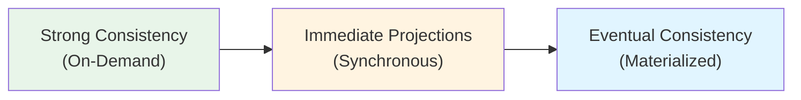
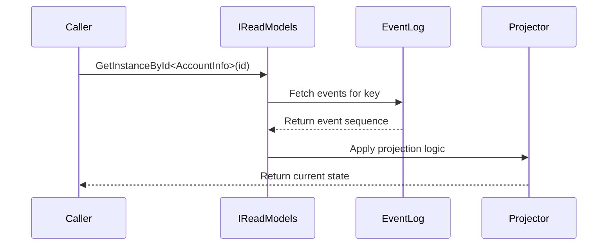
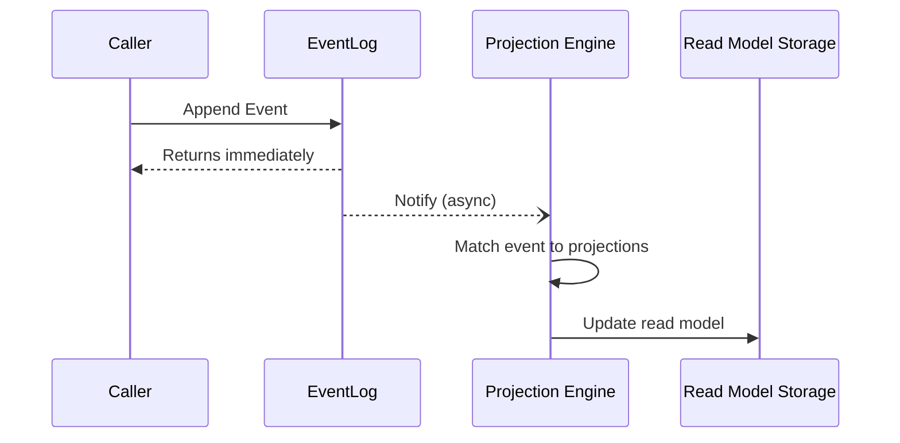

# Consistency Models

Read models in Chronicle can be retrieved with different consistency guarantees, depending on how they are computed and when they reflect the latest events. Understanding these models helps you make the right trade-off between data freshness, query latency, and throughput.

> [!TIP]
> For information on how to define and configure read models in Arc, see <xref:Arc.Chronicle.ReadModels>.

## The Consistency Spectrum

Chronicle offers a spectrum of consistency choices, ranging from strong consistency — where data is guaranteed to reflect all events at query time — to eventual consistency — where data is materialized asynchronously in the background.

Each model has distinct performance and consistency characteristics. The right choice depends on how frequently the data is read, how long the event history is, and how critical it is that queries always return up-to-date state.

## Strong Consistency — On-Demand Computation

The strongest guarantee comes from computing a read model on-demand by replaying events from the event log every time you request it. This is sometimes called an *ad-hoc projection query* because no pre-materialized state is consulted — the result is built fresh from source events on each call.

When you call `GetInstanceById`, Chronicle:

1. Locates the projection or reducer registered for the read model type
2. Retrieves all relevant events for the requested key from the event log
3. Executes the projection or reducer logic in memory, event by event
4. Returns the resulting instance that reflects the exact current state

Because the projection runs inline at query time, you always get a result that is consistent with every event appended so far — including one you may have just appended a millisecond ago.

### When to Use On-Demand Computation

On-demand computation is the right choice when:

- Strong read-after-write consistency is required
- The event history for each instance is short (tens to low hundreds of events)
- The read model is accessed infrequently relative to how often events are appended
- You are validating a command against current state before appending new events

For a practical guide to working with read model instances using this approach, see [Getting a Single Instance](getting-single-instance.md) and [Getting a Collection of Instances](getting-collection-instances.md).

### Performance Considerations

The cost of on-demand computation grows linearly with the number of events in the history. Short histories are fast; histories that run into thousands of events per instance can become too slow for interactive use cases. For high-volume, frequently accessed data, materialized projections are a better fit.

## Immediate Projections — Synchronous Materialization

Immediate projections sit between on-demand computation and eventual consistency. Instead of running the projection at query time, the projection runs synchronously as part of the event append operation itself. The read model is guaranteed to be up to date before the append call returns.

This model provides strong consistency for subsequent queries without incurring event-replay cost at read time. The trade-off is added latency on writes — every append operation waits for the projection to complete before returning.

Use immediate projections when:

- Strong consistency is required and the read model is accessed far more often than events are appended
- You need low query latency without bearing event-replay cost on each read
- The projection logic is fast enough that adding it to the write path is acceptable

For details on configuring and using immediate projections, see [Immediate Projections](../projections/immediate-projections.md).

## Eventual Consistency — Materialized Projections

Most projections in Chronicle operate with eventual consistency. Events are appended to the event log and the append operation returns immediately. The projection engine then processes those events asynchronously in the background, updating the stored read model.

### How Materialization Works

The append operation completes before any projection has run. There is a brief window during which the event is safely stored but the read model has not yet been updated. Under normal conditions this lag is milliseconds, but it grows under heavy load or during recovery.

For a detailed look at how projections are compiled and materialized from definition through to storage — covering the three projection styles and the runtime execution pipeline — see [Projection Architecture](../projections/architecture.md).

### Consistency Guarantees

Materialized projections guarantee:

- **Event ordering**: Events for the same event source key are processed in sequence
- **At-least-once delivery**: Every event will be processed, with automatic retries on failure
- **Partition consistency**: All projections for a given event source key will eventually converge to the correct state

They do **not** guarantee:

- **Immediate consistency**: The stored read model may lag behind the event log
- **Cross-partition ordering**: Events from different event source keys may be projected out of relative order
- **Synchronous updates**: Projection updates always happen after the append returns

For patterns that help you design applications around eventual consistency, see [Eventual Consistency in Projections](../projections/eventual-consistency.md).

### When to Use Materialized Projections

Materialized projections are the right choice when:

- Read models are queried frequently and must respond quickly
- Event histories are long and on-demand computation would be too slow
- The application can tolerate a brief lag between an event being appended and the read model reflecting it
- High read throughput is needed independently of write throughput

## Choosing the Right Model

| Scenario | Recommended Model |
|---|---|
| Financial or inventory checks requiring exact current state | On-demand computation |
| Read-after-write in the same request | On-demand computation |
| Command validation against current state | On-demand computation |
| Low-latency reads with strong consistency | Immediate projections |
| Dashboards and list views over large datasets | Materialized projections |
| Real-time UIs observing changes as they happen | Materialized projections with watchers |
| Infrequently accessed instances with short event histories | On-demand computation |

## Summary

| Model | Updated | Consistency | Read Cost |
|---|---|---|---|
| On-demand computation | At query time | Strong | Proportional to event history length |
| Immediate projections | At event append | Strong | O(1) — stored result |
| Materialized projections | Asynchronously | Eventual | O(1) — stored result |

The three models are not mutually exclusive. A real application often uses materialized projections for high-volume list views, on-demand computation for authoritative state checks, and immediate projections for a small number of read models where strong consistency and fast reads are both required.
