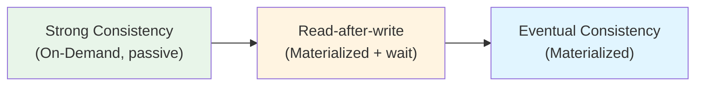
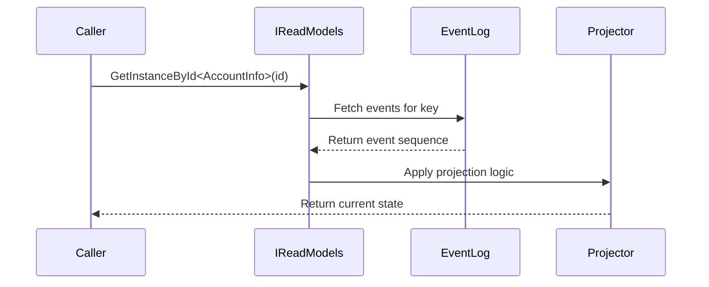
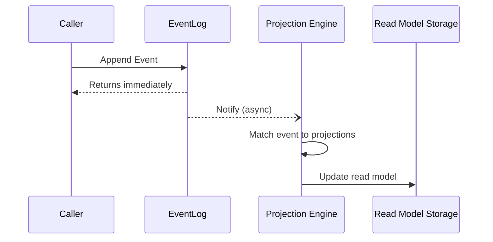

Read models in Chronicle can be retrieved with different consistency guarantees, depending on how they are computed and when they reflect the latest events. Understanding these models helps you make the right trade-off between data freshness, query latency, and throughput.

> [!TIP]
> For information on how to define and configure read models in Arc, see [Chronicle read models in Arc](/arc/backend/chronicle/read-models/).

## The Consistency Spectrum

Chronicle offers a spectrum of consistency choices, ranging from strong consistency — where data is guaranteed to reflect all events at query time — to eventual consistency — where data is materialized asynchronously in the background.

```mermaid
graph LR
    A["Strong Consistency\n(On-Demand, passive)"]
    B["Read-after-write\n(Materialized + wait)"]
    C["Eventual Consistency\n(Materialized)"]

    A --> B --> C

    style A fill:#e8f5e9
    style B fill:#fff4e1
    style C fill:#e1f5ff
```

Each model has distinct performance and consistency characteristics. The right choice depends on how frequently the data is read, how long the event history is, and how critical it is that queries always return up-to-date state.

## Strong Consistency — On-Demand Computation

The strongest guarantee comes from computing a read model on-demand by replaying events from the event log every time you request it. This is sometimes called an *ad-hoc projection query* because no pre-materialized state is consulted — the result is built fresh from source events on each call.

You opt into this by marking the read model **passive**, which keeps any observer from materializing it and therefore leaves the event log as its only source. `GetInstanceById` then:

1. Locates the projection or reducer registered for the read model type
2. Retrieves all relevant events for the requested key from the event log
3. Executes the projection or reducer logic in memory, event by event
4. Returns the resulting instance that reflects the exact current state

> [!IMPORTANT]
> `GetInstanceById` only computes on-demand for a passive read model. When the read model *is* materialized — the default for both projections and reducers — Chronicle serves the stored instance from the sink instead, releasing any PII before it leaves the kernel. That read is O(1) and eventually consistent. See [Getting a Single Instance](getting-single-instance).

```mermaid
sequenceDiagram
    participant Caller
    participant ReadModels as IReadModels
    participant EventLog
    participant Projector

    Caller->>ReadModels: GetInstanceById<AccountInfo>(id)
    ReadModels->>EventLog: Fetch events for key
    EventLog-->>ReadModels: Return event sequence
    ReadModels->>Projector: Apply projection logic
    Projector-->>Caller: Return current state
```

Because the projection runs inline at query time, you always get a result that is consistent with every event appended so far — including one you may have just appended a millisecond ago.

The replay reads only the events of the event source whose id is the key you asked for. That fits a read model keyed by its event source id. A projection that joins events from other event sources, or sets its key from event content with `UsingKey`, misses those events when read this way — keep it materialized, and wait for the append's observers when you need your own write back.

### When to Use On-Demand Computation

On-demand computation is the right choice when:

- Strong read-after-write consistency is required
- The event history for each instance is short (tens to low hundreds of events)
- The read model is accessed infrequently relative to how often events are appended
- You are validating a command against current state before appending new events

When those apply, mark the read model passive — see [Passive projections](../projections/declarative/passive). For a practical guide to working with read model instances, see [Getting a Single Instance](getting-single-instance) and [Getting a Collection of Instances](getting-collection-instances).

### Performance Considerations

The cost of on-demand computation grows linearly with the number of events in the history. Short histories are fast; histories that run into thousands of events per instance can become too slow for interactive use cases. For high-volume, frequently accessed data, materialized projections are a better fit.

## Read-after-write — waiting for a materialized read model

Chronicle has no mode that updates a materialized read model inside the append itself: an append returns once the event is in the log, without waiting for any projection. When one caller needs to read back what it just appended, and the read model should stay materialized for everyone else, wait for the observers affected by that append before reading. In the .NET client, `WaitForCompletion()` on the append result does this and reports any partition that failed while catching up — see [Waiting for observer completion after append](../events/observing-appends.mdx#waiting-for-observer-completion-after-append). Check that the append succeeded before you wait. With the .NET client and an updated server, the wait includes observers that handle the appended event types, plus observers subscribed to all events. Other clients and older servers still wait for every observer on the sequence.

Waiting adds the projection's latency to that one caller, and only that caller. Use it for the occasional read-after-write, not as a default on every append. When nearly every read needs to include the latest event, a passive read model is usually the simpler choice.

There is no *immediate projection* mode that updates a read model during the append. [Immediate projections](../projections/immediate-projections.md) explains what the term does refer to.

## Eventual Consistency — Materialized Projections

Most projections in Chronicle operate with eventual consistency. Events are appended to the event log and the append operation returns immediately. The projection engine then processes those events asynchronously in the background, updating the stored read model.

### How Materialization Works

```mermaid
sequenceDiagram
    participant Caller
    participant EventLog
    participant Engine as Projection Engine
    participant Storage as Read Model Storage

    Caller->>EventLog: Append Event
    EventLog-->>Caller: Returns immediately
    EventLog--)Engine: Notify (async)
    Engine->>Engine: Match event to projections
    Engine->>Storage: Update read model
```

The append operation completes before any projection has run. There is a brief window during which the event is safely stored but the read model has not yet been updated. Under normal conditions this lag is milliseconds, but it grows under heavy load or during recovery.

For a detailed look at how projections are compiled and materialized from definition through to storage — covering the three projection styles and the runtime execution pipeline — see [Projection Architecture](../projections/architecture).

### Consistency Guarantees

Materialized projections guarantee:

- **Event ordering**: Events for the same event source key are processed in sequence
- **At-least-once delivery**: Every event will be processed, with automatic retries on failure
- **Partition consistency**: All projections for a given event source key will eventually converge to the correct state

They do **not** guarantee:

- **Immediate consistency**: The stored read model may lag behind the event log
- **Cross-partition ordering**: Events from different event source keys may be projected out of relative order
- **Synchronous updates**: Projection updates always happen after the append returns

For patterns that help you design applications around eventual consistency, see [Eventual Consistency in Projections](../projections/eventual-consistency).

### When to Use Materialized Projections

Materialized projections are the right choice when:

- Read models are queried frequently and must respond quickly
- Event histories are long and on-demand computation would be too slow
- The application can tolerate a brief lag between an event being appended and the read model reflecting it
- High read throughput is needed independently of write throughput

## Choosing the Right Model

| Scenario | Recommended Model |
|---|---|
| Financial or inventory checks requiring exact current state | On-demand computation |
| Read-after-write in the same request | On-demand computation, or waiting for the append's observers |
| Command validation against current state | On-demand computation |
| Rules that must hold when two writers race | A [constraint](../constraints/index.md) — a read, however consistent, cannot stop the race |
| Dashboards and list views over large datasets | Materialized projections |
| Real-time UIs observing changes as they happen | Materialized projections with watchers |
| Infrequently accessed instances with short event histories | On-demand computation |

## Summary

| Model | Updated | Consistency | Read Cost |
|---|---|---|---|
| On-demand computation (passive) | At query time | Strong | Proportional to event history length |
| Materialized, read after waiting | Asynchronously; the caller waits | Includes the caller's own append | O(1) read, plus the wait |
| Materialized projections | Asynchronously | Eventual | O(1) — stored result |

These are not mutually exclusive. A real application often uses materialized projections for high-volume list views, passive read models for authoritative state checks, and an explicit wait in the few places where one caller must read its own write.
