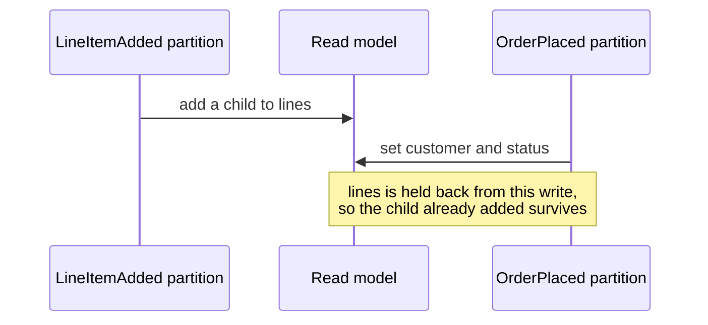

A read model with a `[ChildrenFrom<T>]` collection — or a declarative `.Children(...)` projection — has no children until a child event arrives. That is not an edge case. It is the state every instance is in the moment its root event creates it, so it is the first read of every new instance. This page covers what Chronicle stores then, what you read back, and how to say which answer you want.

## A child collection with no children is not stored

Chronicle never writes a children collection on behalf of the root event. A children path is owned exclusively by the child add and remove operations for the whole lifetime of the read model, and the root projection's initial state is applied with every children path removed.

The reason is replay. Chronicle replays event source partitions independently and in parallel, so a `LineItemAdded` for one partition can be processed before the `OrderPlaced` for the order it belongs to. If the root event were allowed to write `Lines = []`, that empty array would erase the line item the sibling partition had already added.

So absence is the encoding: a child collection with no children is a field that is **not there**, not a field holding `[]`. The exclusion is specific to children collections; the rest of the initial state is applied as written.

## What you read back

When Chronicle materializes a read model for you, a collection property the stored data carries no value for is filled in according to how you declared it:

| Declared as | No value stored | A value stored |
| --- | --- | --- |
| `IEnumerable<LineItem> Lines` | An empty collection | Exactly that value, including `[]` |
| `IEnumerable<LineItem>? Lines` | `null` | Exactly that value, including `[]` |

A non-nullable declaration is a promise, and Chronicle keeps it — you can enumerate the property without a guard, on an instance that has never had a child. A nullable declaration says you want to tell "no children yet" apart from "an empty list", so Chronicle leaves it alone.

Two things stay out of scope. A `string` is left alone even though it is an `IEnumerable`, and so is a dictionary — whether a missing dictionary means an empty one is a different question with a different answer. A collection type Chronicle cannot construct, such as a custom collection with no parameterless constructor, is also left as it was rather than guessed at.

## Say which answer you want

The declaration is the decision point. There is no option to set and nothing to register:

<ChronicleClientTabs snippet="read-models/empty-child-collections/declaring" />

The rule is applied when the instance is materialized, not when it is stored, so changing a declaration takes effect for instances that were written long before you changed it. Nothing needs replaying.

:::caution
A normalizer in the record — `IEnumerable<LineItem> Lines { get; init; } = Lines ?? [];` — looks like the obvious in-language fix, and it is not one. The MongoDB driver materializes a record without running its constructor whenever the stored document omits a member, which is exactly this case, so the normalizer never runs. [Designing read models](../concepts/designing-read-models#the-constructor-may-not-run) explains why the record body is the wrong place for it.
:::

## Initial values do not reach a child collection

[Initial values](../projections/declarative/initial-values) look like the place to say "this collection starts empty", and for a children collection they do nothing. The initial state is applied with every children path removed — the same exclusion, for the same replay reason — so an initial `Lines = []` is dropped before it reaches the sink.

Use the declaration instead. Initial values remain the right tool for business defaults, sentinel values, and properties that are not children collections.

## Where these semantics apply

These rules belong to Chronicle's reader, not to the stored document. They apply wherever Chronicle materializes the read model for you — [reading a single instance](getting-single-instance), [reading a collection](getting-collection-instances), [materialized instances and paging](materialized-pagination), [snapshots](getting-snapshots), [watching a read model](watching-read-models), and [read model reactors](reacting-to-changes) — and to anything layered on those APIs. The [read model testing scenarios](/chronicle/testing/read-models/scenario/) materialize through the same code, so a spec and a running system answer this question identically.

They do **not** apply when something else deserializes the same stored document. If you query the read model's MongoDB collection directly with `IMongoCollection<T>`, as [Get started](/chronicle/get-started/) shows for reporting and ad-hoc reads, the MongoDB driver builds the instance — and the driver has never heard of this page. Left alone, it hands you `null` for a field the document does not carry.

If you are on [Cratis Arc](/arc/backend/mongodb/convention-packs/), you already have the answer: Arc registers a convention pack that materializes a non-nullable collection on a `[ReadModel]` type as empty, for both an absent field and a stored `null`. It makes the driver agree with this page rather than differ from it. Without Arc, configure the equivalent on the driver yourself, or read through Chronicle.

:::caution
The driver does not run your record's constructor. A read model with a primary constructor gets no creator map at all, so the driver materializes it uninitialized and assigns members directly — on every document, not only an incomplete one. A normalizer written in the record body (`Lines = Lines ?? []`) therefore never executes on this path, and neither does any other default, clamp or guard you put there. See [The constructor may not run](../concepts/designing-read-models#the-constructor-may-not-run).
:::

:::note[Client coverage]
The absent-collection rule is applied by the .NET client's read model reader. Other clients materialize read models with their own runtime's deserialization — check what yours does with a missing field before relying on a non-nullable declaration.
:::

## Related topics

- [Children Collections](../projections/model-bound/children) - Declaring child collections on a read model
- [Consistency Models](./consistency.md) - When a read model has to be correct
- [Sinks](../sinks/) - Where read model instances are stored
