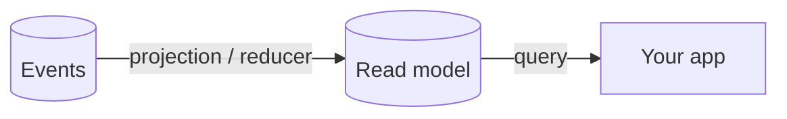

# Read Models

Your events are the truth of *what happened*, but they're a terrible thing to query — to show an
account balance you'd have to replay every deposit and withdrawal. A **read model** is the answer to
that: a shaped, queryable view of your data, built from events and kept up to date for you. It's the
"read side" of CQRS — the events are the write side.

The power is specialization: one event log can feed *many* read models, each tailored to a single
screen or question. You don't reuse one model across conflicting needs — you build a focused one per
view, so each stays small, fast, and independent.

## How a read model gets built

You don't write to a read model directly — an [observer](../concepts/observers/) keeps it in sync with
the events:

- A [projection](../projections/) maps events into the model declaratively — the usual choice.
- A [reducer](../reducers/) folds events into the model imperatively, when you need more control.

## What to read next

| Topic | What it covers |
| ------- | ----------- |
| [Consistency models](./consistency.md) | The key decision: when does the read model have to be correct — immediately, or eventually? |
| [Getting a single instance](./getting-single-instance.md) | Retrieve one read model instance by its key. |
| [Getting a collection](./getting-collection-instances.md) | Retrieve all instances of a read model. |
| [Getting snapshots](./getting-snapshots.md) | Retrieve historical snapshots of a read model's state. |
| [Watching read models](./watching-read-models.md) | Observe a read model and react to changes in real time. |

To expose a read model to a React frontend, pair it with an [Arc query](/arc/backend/queries/) — or see
the whole loop in [Build a full-stack feature](/build-a-full-app/).
