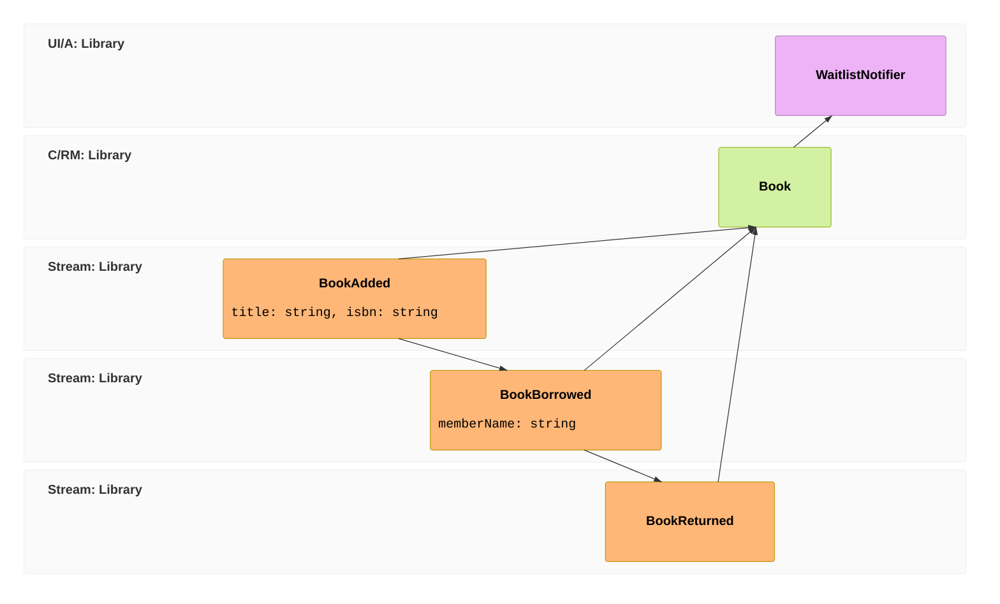

Imagine you're building the system for a small town library. Books arrive, members borrow them, and eventually bring them back — and when a popular title comes back, the next person on the waitlist should hear about it. It's a small domain, but it has everything event sourcing is good at: things *happen*, in order, over time, and you care about the history, not just the latest state.

Over the next three short chapters we'll build it together with Chronicle. We won't rush to the finish — at each step we'll stop to look at what just happened and why, so that by the end you don't just have working code, you understand the model well enough to build your own.

Here's the whole system we're heading toward, drawn as an **[event model](/event-modeling/)** — read it left to right like a comic strip: facts happen over time, get folded into a read model you can query, and trigger a reaction. Don't worry if the pieces aren't familiar yet; we'll meet each one in turn.

Every block is a real Chronicle primitive — which is what makes an event model such a good plan. The `evt` blocks become `[EventType]` records, the `rmo` (built from all three events) becomes a `[ReadModel]` with a projection, and the `pcr` becomes an `IReactor`. You'll build them in that order. There's no screen or command here because Chronicle appends events directly — put a UI and commands on top with [Arc](/arc/) and the model gains those blocks too, as [the full-stack capstone](/build-a-full-app/) shows.

## What you'll need

A Chronicle project running locally — the [Get started](/chronicle/get-started/) guide gets you there in a couple of minutes (install the template, scaffold, `docker compose up`). Come back when `dotnet run` works, and we'll start writing the library.

## The tour

1. **[Your first event](./first-event.md)** — record the fact that a book arrived, and meet the event log.
2. **[Building a read model](./read-model.md)** — turn that stream of facts into something you can actually query.
3. **[Reacting to events](./reacting.md)** — do something useful when a book comes back.

By the end you'll have built the loop at the heart of every Chronicle app — *append a fact, project it into state, react to it* — and you'll know it well enough to leave the library behind and model your own domain. Ready? [Let's record the first thing that happens →](./first-event.md)
