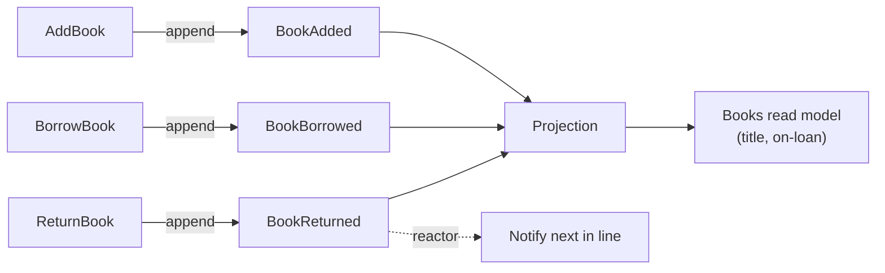

This tutorial builds a small **library** system with Chronicle. You start with a single event and grow it into a system that tracks books, knows which ones are on loan, and reacts when one is returned. By the end you will have written events, projected them into read models, and reacted to them — the three things you do with Chronicle every day.

It is deliberately incremental. Each chapter introduces **one** concept, shows it working, and recaps before the next builds on it. You do not need prior event-sourcing experience; if a term is unfamiliar, the [Glossary](/chronicle/concepts/glossary/) defines it.

## What you'll build

## Before you start

Have a Chronicle project running locally. The quickest way is the [Get started](/chronicle/get-started/) guide — install the templates, scaffold a console app, and `docker compose up`. Come back here when `dotnet run` works.

## Chapters

1. [Your first event](./first-event.md) — define a fact and append it.
2. [Building a read model](./read-model.md) — project events into something you can query.
3. [Reacting to events](./reacting.md) — run a side effect when something happens.

When you finish, the [Concepts](/chronicle/concepts/) section goes deeper on everything you touched, and the [Guides](/chronicle/projections/) show the full range of each feature.
