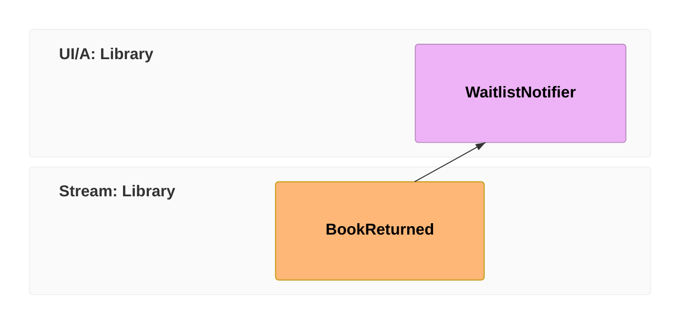

Our library can record what happens and show the catalog. One thing's missing: when a popular book comes back, the next person waiting for it should hear about it. Projections build *state*; for *doing something* — sending a notification, calling another system, kicking off a process — we reach for a **reactor**. Let's write one, and meet the rules that keep it well-behaved.

In [event-modeling](/event-modeling/) terms this is the **automation pattern** — a processor watches for an event and acts. It's the last block in our model:



## A reactor is just a class that watches for an event

`IReactor` is a marker — there's no method to override. Instead you write a method whose **first parameter is the event you care about**, and Chronicle routes matching events to it. So "when a book is returned, notify the next person" reads almost exactly like that in code:

```csharp
public class WaitlistNotifier(INotificationService notifications) : IReactor
{
    public async Task BookReturned(BookReturned @event, EventContext context)
    {
        // context.EventSourceId is the BookId this happened to
        await notifications.NotifyNextInLine(context.EventSourceId);
    }
}
```

Chronicle discovers this by convention — no registration, no wiring. Drop the class in, and every `BookReturned` now flows to it.

## Why your reactor must be safe to repeat

Here's the rule that catches everyone once: **a reactor may run more than once for the same event.** During a replay, a recovery, or a redeploy, Chronicle might hand it `BookReturned` again. If your reactor naively emails the next member every time it runs, that member gets emailed twice. So design the side effect to be *idempotent* — for example, record that a notification was sent and skip it if it already was. Repeatable by design.

:::caution[Two things a reactor must never do]
**Don't read the read model to make a decision** — it may not have caught up yet ([eventual consistency](/chronicle/read-models/)). Everything you need is already in the event and its `EventContext`; use that.

**Don't write to the event log directly.** If reacting should produce *new* facts, execute a command through the command pipeline — reactors cause effects, they don't author history.
:::

## Use the event, not a lookup

Notice we didn't query anything to find out *which* book was returned — `context.EventSourceId` told us. That's deliberate. The event carries the truth of what happened; leaning on it (instead of querying back) is what makes reactors fast, order-independent, and safe to replay.

## You've built a library

Step back and look at what you have. Facts go in as **events**. A **projection** folds them into a `Books` read model you can query. And a **reactor** acts when something happens. That loop — *append → project → react* — is the entire shape of a Chronicle application. You just built it end to end.

Where to go from here:

- **Go deeper on each piece** — [Concepts](/chronicle/concepts/), and the guides for [Projections](/chronicle/projections/), [Reactors](/chronicle/reactors/), and [Reducers](/chronicle/reducers/).
- **Put a UI and commands on top** — take the same model full-stack with [Arc](/arc/) and [Components](/components/) in [Build a full-stack feature](/build-a-full-app/).
- **Model your own domain** — you now know enough to leave the library behind. When you do, start by asking the only question that matters: *what happened?*
- **Hit a snag?** — [Troubleshooting](/chronicle/troubleshooting/) has the common ones.
