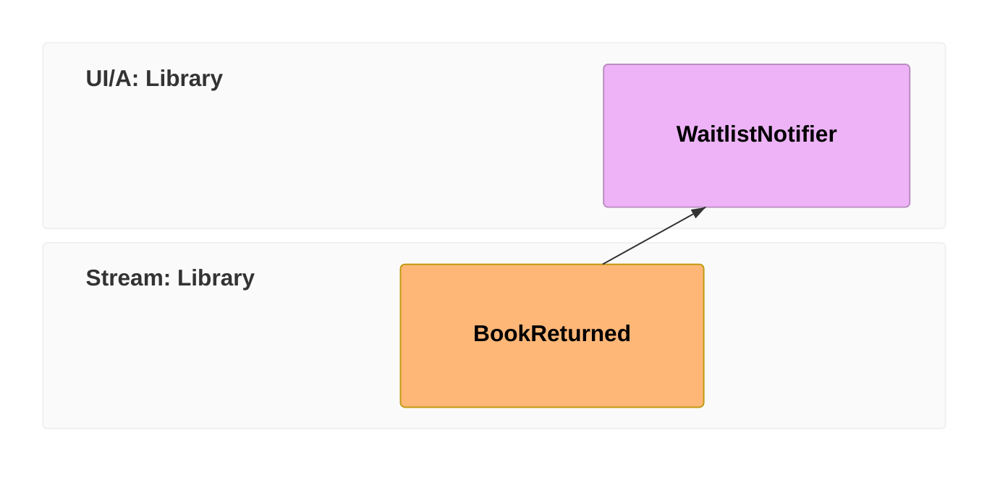

Our library can record what happens and show the catalog. One thing's missing: when a popular book comes back, the next person waiting for it should hear about it. Projections build *state*; for *doing something* — sending a notification, calling another system, kicking off a process — we reach for a **reactor**. Let's write one, and meet the rules that keep it well-behaved.

In [event-modeling](/event-modeling/) terms this is the **automation pattern** — a processor watches for an event and acts. It's the last block in our model:



## A reactor is just a class that watches for an event

`IReactor` is a marker — there's no method to override. Instead you write a method whose **first parameter is the event you care about**, and Chronicle routes matching events to it. So "when a book is returned, notify the next person" reads almost exactly like that in code:

```csharp
public class WaitlistNotifier(INotificationService notifications) : IReactor
{
    public async Task BookReturned(BookReturned @event, EventContext context)
    {
        // context.EventSourceId is the BookId this happened to
        await notifications.NotifyNextInLine(context.EventSourceId);
    }
}
```

Chronicle discovers this by convention — no registration, no wiring. Drop the class in, and every `BookReturned` now flows to it.

## Why your reactor must be safe to repeat

Here's the rule that catches everyone once: **a reactor may run more than once for the same event.** During a replay, a recovery, or a redeploy, Chronicle might hand it `BookReturned` again. If your reactor naively emails the next member every time it runs, that member gets emailed twice. So design the side effect to be *idempotent* — for example, record that a notification was sent and skip it if it already was. Repeatable by design.

For side effects that genuinely must never repeat — a physical letter, a payment — Chronicle gives you `[OnceOnly]`. Put it on the reactor class, or on just one handler method, and that handler is **excluded from replay** entirely: redactions, revisions, and observer rewinds all skip it, so it runs only once per event.

```csharp
public class WaitlistNotifier(INotificationService notifications) : IReactor
{
    [OnceOnly]
    public async Task BookReturned(BookReturned @event, EventContext context) =>
        await notifications.NotifyNextInLine(context.EventSourceId);
}
```

Use it deliberately, though — the same guarantee means a `[OnceOnly]` handler also *won't* run again when you replay on purpose. Idempotent-by-design stays the default; `[OnceOnly]` is for the effects where "again" is worse than "never".

:::tip[Two things you can do — keep these in mind]
**Read state — at the right consistency level.** `BookReturned` carries no title, so a friendlier notification ("*The Pragmatic Programmer* is back!") needs the `Book` read model. Just know your [consistency levels](../concepts/consistency.md): the materialized collection you queried last chapter is *eventually* consistent — it may not have caught up with the very event you're handling. When a decision needs current state — and it usually does — go through the strongly consistent `IReadModels` interface instead, which [re-derives the instance from the event log on demand](../read-models/getting-single-instance.md):

```csharp
public class WaitlistNotifier(IEventStore eventStore, INotificationService notifications) : IReactor
{
    public async Task BookReturned(BookReturned @event, EventContext context)
    {
        var book = await eventStore.ReadModels.GetInstanceById<Book>(context.EventSourceId);
        await notifications.NotifyNextInLine(context.EventSourceId, book.Title);
    }
}
```

**Produce new facts.** Reacting often *is* a new fact — "we told the next member" deserves its own event:

```csharp
[EventType]
public record WaitlistNotificationSent;
```

You can append it yourself — but then **handle the result**, and throw if it failed, so the failure surfaces (and the partition pauses for a retry) instead of the fact silently going missing:

```csharp
var result = await eventStore.EventLog.Append(context.EventSourceId, new WaitlistNotificationSent());
if (!result.IsSuccess) throw new NotificationWasNotRecorded(context.EventSourceId);
```

Or skip the plumbing with **side effects**: return the event from the handler, and Chronicle appends it to the event log for you — against the same book's stream:

```csharp
public async Task<WaitlistNotificationSent> BookReturned(BookReturned @event, EventContext context)
{
    await notifications.NotifyNextInLine(context.EventSourceId);
    return new WaitlistNotificationSent();
}
```

:::

## Use the event, not a lookup

Notice we didn't query anything to find out *which* book was returned — `context.EventSourceId` told us. That's deliberate. The event carries the truth of what happened; leaning on it (instead of querying back) is what makes reactors fast, order-independent, and safe to replay. And when an event genuinely doesn't carry enough — `BookReturned` has no title — reach for the strongly consistent read shown above, not the eventually consistent collection.

## You've built a library

Step back and look at what you have. Facts go in as **events**. A **projection** folds them into a `Books` read model you can query. And a **reactor** acts when something happens. That loop — *append → project → react* — is the entire shape of a Chronicle application. You just built it end to end.

Where to go from here:

- **Go deeper on each piece** — [Concepts](/chronicle/concepts/), and the guides for [Projections](/chronicle/projections/), [Reactors](/chronicle/reactors/), and [Reducers](/chronicle/reducers/).
- **Put a UI and commands on top** — take the same model full-stack with [Arc](/arc/) and [Components](/components/) in [Build a full-stack feature](/build-a-full-app/).
- **Model your own domain** — you now know enough to leave the library behind. When you do, start by asking the only question that matters: *what happened?*
- **Hit a snag?** — [Troubleshooting](/chronicle/troubleshooting/) has the common ones.
