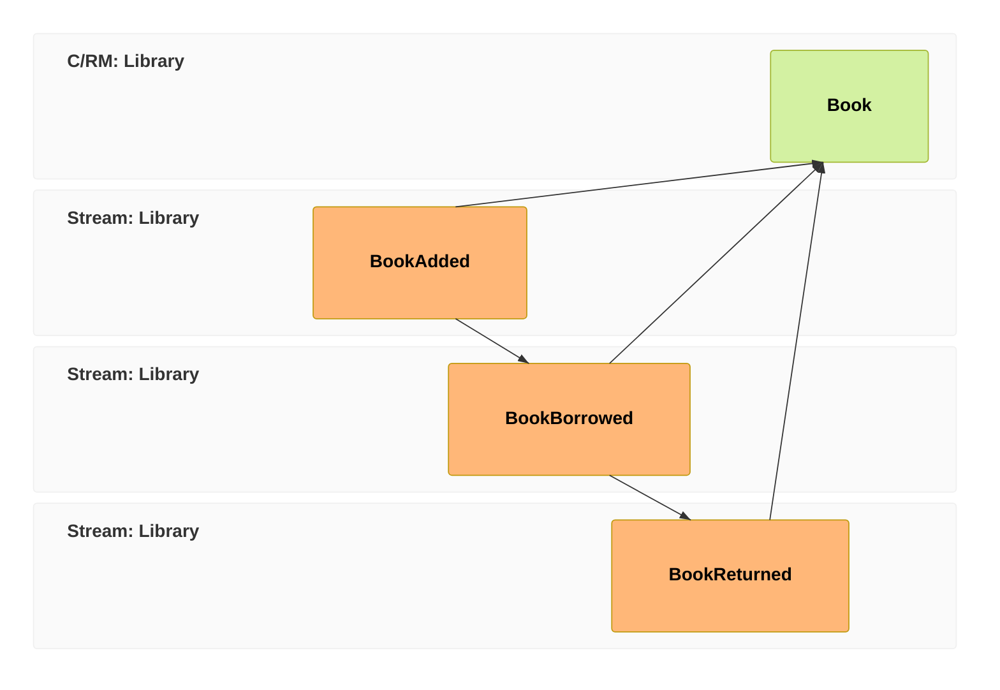

We can record that a book arrived, but the librarian can't *see* the catalog yet — the books live only as history in the log. In this chapter we'll fix that: we'll build a `Books` read model that always reflects the current state of every book, and — here's the part that surprises people coming from CRUD — we'll do it **without writing a single line that updates anything**.

In [event-modeling](/event-modeling/) terms that's the **view pattern** — events fold into a read model the UI can query. It's the slice of the model we build in this chapter:



## First, a couple more facts

A book doesn't just arrive; it gets borrowed and brought back. Those are facts too, so they're events:

```csharp
[EventType]
public record BookBorrowed(string MemberName);

[EventType]
public record BookReturned;
```

Notice `BookReturned` has no data at all — and that's fine. The fact that it *happened*, on a particular book's stream, at a particular time, is the whole story. Not every event needs a payload.

## Declare what you want to read

Here's the shift. In a database you'd write code to keep a `Books` table in sync — insert on add, update a flag on borrow, update it back on return. In Chronicle you instead **declare the shape you want** and tell it which events feed it. Chronicle does the keeping-in-sync for you. That declaration is a [projection](/chronicle/concepts/projection/):

```csharp
using Cratis.Chronicle.Keys;
using Cratis.Chronicle.Projections.ModelBound;

public record Book(
    [Key]
    BookId Id,

    [SetFrom<BookAdded>(nameof(BookAdded.Title))]
    string Title,

    [SetFrom<BookAdded>(nameof(BookAdded.Isbn))]
    string Isbn,

    [SetValue<BookAdded>(false)]
    [SetValue<BookBorrowed>(true)]
    [SetValue<BookReturned>(false)]
    bool OnLoan,

    [SetFrom<BookBorrowed>(nameof(BookBorrowed.MemberName))]
    string? BorrowedBy);
```

Read the attributes as a sentence: a book's `Title` and `Isbn` are taken from `BookAdded`; `OnLoan` is `false` when the book is added, `true` when it's borrowed, and `false` again when it's returned; `BorrowedBy` is set to whoever borrowed it. You're *declaring* how each fact maps onto the view — not writing imperative updates, not worrying about ordering. Chronicle replays the events in order and applies your mapping.

:::tip[Reach for the declarative path first]
For mappings like this — "events map onto fields" — the model-bound attributes (`[SetFrom<T>]`, `[SetValue<T>]`, and `[FromEvent<T>]` for whole-event AutoMap) express it with almost no code. Only when a view genuinely needs hand-written, imperative folding should you drop to a [reducer](/chronicle/reducers/). Try the projection first; you'll rarely need more.
:::

## Query it

By default Chronicle **materializes** the projection into its configured **sink** storage — MongoDB unless you change it — so the `Book` read model is just a collection you query, exactly what you're used to:

```csharp
public class Books(IMongoCollection<Book> collection)
{
    public IEnumerable<Book> OnLoan() => collection.Find(b => b.OnLoan).ToList();
}
```

Now exercise it. Append a `BookBorrowed` for your book and query again — `OnLoan` is `true`, and `BorrowedBy` has the member's name. Append a `BookReturned` and it flips back. You never wrote an `UPDATE`. The projection did it, by re-deriving the book from its events.

:::note[A heartbeat of delay]
The read model updates *just after* the event is appended, not in the same instant — it's [eventually consistent](/chronicle/read-models/). For a UI that's usually imperceptible (and you can subscribe to live updates). It only matters when you need to make a decision based on current state — which is what constraints and the next chapter's tools are for.
:::

## What you did

- Added the events that make up a book's life (`BookBorrowed`, `BookReturned`).
- **Declared** a `Books` read model and how events map onto it — no update code anywhere.
- **Queried** it like ordinary data, and watched it stay correct on its own.

You can now see the catalog. The last piece is to make the library *do* something when the world changes — when a book comes back, tell the next person waiting for it. That's a job for a reactor, and it's the [final chapter](./reacting.md). [Let's finish the tour →](./reacting.md)
