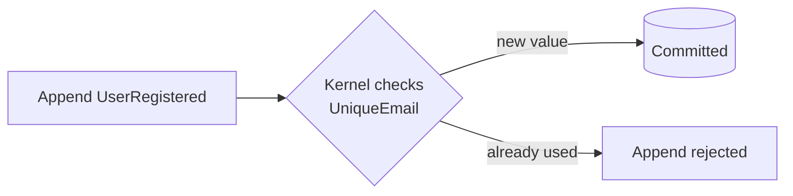
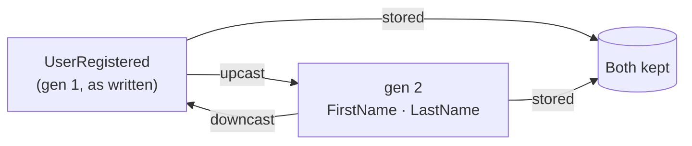

Two questions stop a lot of teams at the door of event sourcing, and they're good questions:

1. **"If state is derived from events, how do I stop two users registering the same email?"** There's no table to put a `UNIQUE` index on.
2. **"Events are immutable — so what happens when I need to rename or split a field a year from now?"** You can't go back and edit history.

Both have clean answers in Chronicle, and both are handled in the **kernel** — the server — so every client gets them for free. This page is the mental model; each section links to the reference and the recipe that take you further.

## Enforcing uniqueness without a unique index

The worry is real: in a classic CRUD app you lean on a database `UNIQUE` constraint, but here the "current state" is a projection, built *after* the fact. By the time a read model notices a duplicate email, the duplicate event is already in the log.

Chronicle's answer is to check the rule **before the event is committed**, inside the kernel. You declare it right on the event — adorn the property with `[Unique]`:

```csharp
[EventType]
public record UserRegistered([Unique(name: "UniqueEmail")] string Email, string DisplayName);
```

Now an append that would introduce a duplicate email is *rejected at the source* — it never reaches the log. Because the check lives in the kernel, it's consistent across every client and every entry point: a .NET client, a REST call, or a future integration you haven't written yet.



A few things make this practical:

- **One rule can span several events.** Give the same `name` to `[Unique]` on `UserRegistered.Email` and `UserEmailChanged.NewEmail`, and a changed email is checked against registered ones too — the rule follows the *value*, not a single event type.
- **Values can be released.** When the thing that held the value goes away, mark that event with `[RemoveConstraint("UniqueEmail")]` (a `UserRemoved`, say) so the email can be claimed again.
- **It surfaces as a failed append**, which a command turns into a friendly "that email's taken" on the form, instead of a 500.

→ The full reference is in [Constraints](/chronicle/constraints/) (model-bound `[Unique]`, grouping, and declarative rules for the complex cases); the step-by-step recipe is [Enforce a unique value](/chronicle/scenarios/enforce-a-unique-value/).

## Changing an event's shape after it's written

The second fear is sharper, because immutability sounds like a trap: if you wrote `Name` two years ago and now want `FirstName` and `LastName`, you can't rewrite two years of history.

Chronicle's answer is **generations**. Each version of an event type is a generation, and you describe how to move between adjacent generations in *both* directions — **upcast** (old → new, e.g. split `Name`) and **downcast** (new → old, e.g. recombine). You never edit the old events; you teach the kernel how to *translate* them.



What that buys you is unusual, and worth sitting with:

- **The original is never touched.** A generation-1 event written two years ago is still there, byte for byte. Migrations produce *additional* representations alongside it, never instead of it.
- **The kernel stores every generation.** Append a gen-1 event with a 1→2 migration and the kernel keeps both gen 1 and the upcasted gen 2.
- **Two versions of your software can share one store.** Service A on the new code reads gen 2; Service B on the old code reads gen 1 — the same physical event, each getting the generation it understands, with no upgrade coordination between them.
- **Back-filling is automatic.** Register a new generation and Chronicle starts a background job that produces it for all existing events. You don't trigger it, and you don't wait for it.

→ The full story — declaring migrators, the C# API, and generation validation — is in [Migrations](/chronicle/migrations/); the recipe is [Evolve an event](/chronicle/scenarios/evolve-an-event/).

## The pattern behind both

Notice the shape the two answers share: the hard part lives in the **kernel**, is declared close to the **event**, and applies to **every** client with no coordination. That's the same principle as the rest of Chronicle — the event log is the source of truth, and the rules that protect and translate it live *with* it, not scattered through application code. Once that clicks, neither uniqueness nor schema change is the obstacle it first appears to be.

Next, see them in code: [enforce a unique value](/chronicle/scenarios/enforce-a-unique-value/) and [evolve an event](/chronicle/scenarios/evolve-an-event/).
