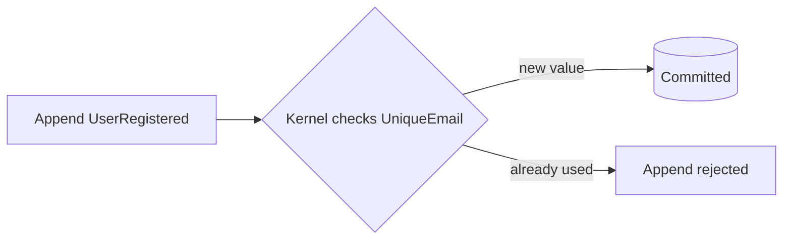

One question stops a lot of teams at the door of event sourcing, and it's a good one: **"If state is derived from events, how do I stop two users registering the same email?"** There's no table to put a `UNIQUE` index on.

Chronicle's answer is **constraints** — rules you declare next to your events, enforced in the **kernel** before an event is committed. This page is the mental model: why the check has to live server-side, the two ways to declare a rule, and how a violation surfaces. The exhaustive options live in the [Constraints reference](/chronicle/constraints/).

## Why the check belongs in the kernel

The worry is real: in a classic CRUD app you lean on a database `UNIQUE` constraint, but here the "current state" is a projection, built *after* the fact. By the time a read model notices a duplicate email, the duplicate event is already in the log. Checking the read model *before* appending doesn't save you either — two requests can both pass the check and both append.

Chronicle closes that gap by checking the rule **before the event is committed**, inside the kernel:



An append that would introduce a duplicate is *rejected at the source* — it never reaches the log. Because the check lives in the kernel, it's consistent across every client and every entry point: a .NET client, a REST call, or a future integration you haven't written yet. No constraint logic runs in your application code.

## Declare it on the event

The simplest way to declare a rule is right where the value lives — adorn the event property with `[Unique]`:

```csharp
[EventType]
public record UserRegistered([Unique(name: "UniqueEmail")] string Email, string DisplayName);
```

That one attribute is the whole client-side story. When your application starts, Chronicle scans for `[Unique]`-adorned types, registers the constraint with the kernel, and the kernel builds the indexes it needs to enforce it on every subsequent append.

A few things make this practical:

- **One rule can span several events.** Give the same `name` to `[Unique]` on `UserRegistered.Email` and `UserEmailChanged.NewEmail`, and a changed email is checked against registered ones too — the rule follows the *value*, not a single event type.
- **Some events are one-of-a-kind.** Put `[Unique]` on the event *type* instead of a property, and only one event of that type can ever be appended per event source — registering the same user twice becomes impossible by declaration:

```csharp
[EventType]
[Unique]
public record UserRegistered(string Email, string DisplayName);
```

- **Values can be released.** When the thing that held the value goes away, mark that event with `[RemoveConstraint]` so the value can be claimed again:

```csharp
[EventType]
[RemoveConstraint("UniqueEmail")]
public record UserRemoved(UserId UserId);
```

The reference calls this attribute style [model-bound constraints](/chronicle/constraints/model-bound/) — every parameter and combination is documented there.

## When the rule outgrows an attribute

Attributes shine when the rule belongs to one event type. Some rules don't: the same logical value appears under *different property names* in different events, the comparison should ignore casing, or the violation message needs to be composed from context. For those, declare the rule in a dedicated class — implement `IConstraint` and describe it with the builder:

```csharp
using Cratis.Chronicle.Events.Constraints;

public class UniqueEmail : IConstraint
{
    public void Define(IConstraintBuilder builder) =>
        builder.Unique(unique =>
            unique
                .WithName("UniqueEmail")
                .On<UserRegistered>(e => e.Email)
                .On<UserEmailChanged>(e => e.NewEmail)
                .IgnoreCasing()
                .RemovedWith<UserRemoved>()
                .WithMessage("That email address is already in use."));
}
```

Read it top to bottom and it says exactly what the rule is: one named constraint, fed by two events with differently named properties, case-insensitive, released when the user is removed, with a friendly message when it fires. The one-of-a-kind variant has a builder form too — `builder.Unique<UserRegistered>()` enforces a single `UserRegistered` per event source.

Like the attributes, `IConstraint` implementations are **discovered automatically** when the client starts — no registration call. And crucially, both styles compile down to the *same* kernel-side constraint; which one you pick is purely about where the rule reads best. The full builder surface — names, messages, message callbacks, removal — is in the [declarative constraints reference](/chronicle/constraints/declarative/).

## What a violation looks like

A violated constraint surfaces as a **failed append** — the result tells you which constraint fired and carries the message you declared. A command turns that into a friendly "that email's taken" on the form, instead of a 500. The step-by-step recipe, including handling the failure, is [Enforce a unique value](/chronicle/scenarios/enforce-a-unique-value/).

## Privacy and PII protection

Chronicle protects sensitive information in constraint indexes by **hashing all constraint values** before storage. When you declare a unique constraint on an email address, phone number, or other potentially sensitive data, Chronicle:

1. Concatenates the property values (if the constraint spans multiple properties).
2. Normalizes the value (lowercases it if `IgnoreCasing()` is enabled).
3. Computes a **SHA-256 hash** of the result.
4. Stores only the hash in the constraint index, never the raw value.

This means the kernel can still enforce uniqueness — two identical values produce the same hash — but the constraint index itself contains no PII. The actual property values remain visible only in the events themselves, where Chronicle's encryption and compliance features already protect them.

**Note:** The hash transformation is transparent to your code. You declare constraints on plain properties, violation messages show the readable values (so the user sees "email@example.com already exists"), but storage uses hashes under the hood. This design keeps PII out of constraint indexes without sacrificing developer experience or user-facing clarity.

## Constraints and concurrency

Constraints are one half of data integrity; the other half is **concurrency**. They guard against different things:

- A **constraint** protects a *value* across the whole event store — no two users may ever hold the same email, no matter who appends or when.
- A **concurrency scope** protects a *moment* — when two requests race to append to the same event source, the one that acted on stale state is rejected instead of silently interleaving.

Both checks run in the kernel at append time, and both surface as a failed append you can handle. When you find yourself worried about "two requests at once" rather than "the same value twice," reach for [concurrency scopes](/chronicle/events/concurrency/).

## The pattern to take with you

Notice the shape of the answer: the hard part lives in the **kernel**, is declared close to the **event**, and applies to **every** client with no coordination. That's the same principle as the rest of Chronicle — the event log is the source of truth, and the rules that protect it live *with* it, not scattered through application code. The same shape answers the other question that makes people nervous about event sourcing — changing an event's shape after it's written — in [Understanding event evolution](./understanding-event-evolution.md).
