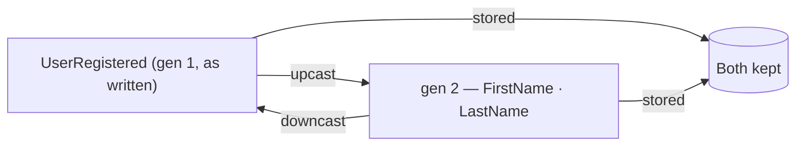

Here's the question that makes immutability sound like a trap: **"Events are immutable — so what happens when I need to rename or split a field a year from now?"** You can't go back and edit history. If you wrote `Name` two years ago and now want `FirstName` and `LastName`, you can't rewrite two years of events.

Chronicle's answer is **generations**. This page is the mental model; the full API and the recipe are linked at the end.

## Translate, never edit

Each version of an event type is a generation, and you describe how to move between adjacent generations in *both* directions — **upcast** (old → new, e.g. split `Name`) and **downcast** (new → old, e.g. recombine). You never edit the old events; you teach the kernel how to *translate* them.

What that buys you is unusual, and worth sitting with:

- **The original is never touched.** A generation-1 event written two years ago is still there, byte for byte. Migrations produce *additional* representations alongside it, never instead of it.
- **The kernel stores every generation.** Append a gen-1 event with a 1→2 migration and the kernel keeps both gen 1 and the upcasted gen 2.
- **Two versions of your software can share one store.** Service A on the new code reads gen 2; Service B on the old code reads gen 1 — the same physical event, each getting the generation it understands, with no upgrade coordination between them.
- **Back-filling is automatic.** Register a new generation and Chronicle starts a background job that produces it for all existing events. You don't trigger it, and you don't wait for it.

## Why the kernel owns this

Migrations run inside the **kernel** — the server — not in your application. That matters more than it first appears: once a migrator is registered, it applies to every event that passes through, whether it came from a .NET client, a REST call, or an integration written long after the migration shipped. Clients that are offline or still running older code are unaffected; they keep reading the generation they understand.

This is the same principle that answers the other question that makes people nervous about event sourcing — enforcing uniqueness without a unique index. The hard part lives in the kernel, is declared close to the event, and applies to every client with no coordination. See [Understanding constraints](./understanding-constraints.md) for that half of the story.

## Where to go next

The full story — declaring migrators, the C# API, and generation validation — is in [Migrations](/chronicle/migrations/); the step-by-step recipe is [Evolve an event](/chronicle/scenarios/evolve-an-event/). Once the translate-don't-edit model clicks, schema change stops being the obstacle it first appears to be.
