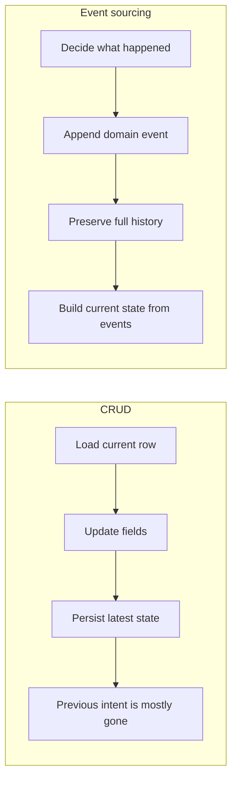
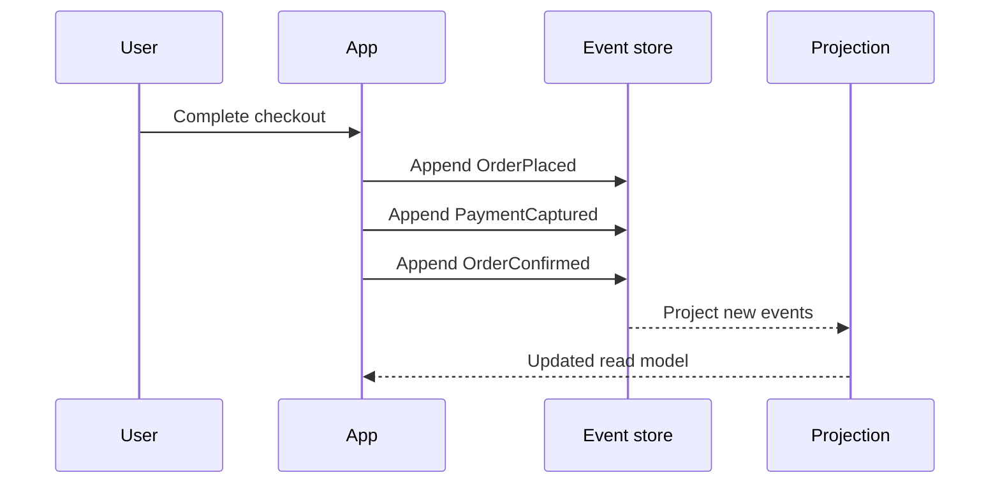

# Why Event Sourcing

Event sourcing optimizes for understanding change, not just storing the latest value. Instead of asking "what does the row look like now?", you ask "what happened, in what order, and why?"

At Cratis, we see event sourcing as the default architecture for information systems. Not because every table deserves an event stream, but because most real systems are driven by processes, decisions, and handoffs over time — and those facts become more valuable the longer the system lives. Chronicle models those changes as [events](./concepts/event.md) in an [event store](./concepts/event-store.md), grouped by [event source](./concepts/event-source.md), and then turns them into queryable views through [projections](./concepts/projection.md).

This page explains why we choose event sourcing as the starting point for information systems and how Chronicle supports both classic aggregate-root thinking and Dynamic Consistency Boundary.

## CRUD focuses on state, event sourcing focuses on change

CRUD systems center on the current shape of data:

- Create a record
- Update a few fields
- Delete a row

That works well when the current state is all you care about. The trade-off is that the path that led to that state often disappears unless you add separate audit infrastructure.

Event sourcing starts from a different question: what meaningful state changes happened?

- `CustomerRegistered`
- `AddressChangedForCustomer`
- `PaymentCaptured`
- `OrderShipped`

Those events tell a story. You do not just know that a field changed. You know what changed in domain terms, when it changed, and how the process moved forward.

## Events make behavior transparent

With CRUD, an `UPDATE Customers SET Address = ...` statement tells you very little about the business meaning. Did the customer move? Did support correct a typo? Was this part of a larger onboarding step?

With event sourcing, the event itself communicates intent. That makes the system easier to understand for developers, operators, auditors, and downstream consumers.

This is one of the biggest practical differences:

- CRUD records the latest shape of data
- Event sourcing records meaningful transitions in the business

When the record of change is meaningful, your system becomes more transparent. You can reason about what is going on without reverse-engineering it from final state alone.

## Events help you think in processes

Most business problems are not really about changing isolated fields. They are about moving through a process:

- a person registers
- an order is approved
- a shipment is dispatched
- an invoice is paid

CRUD tends to pull your thinking toward tables and columns. Event sourcing pulls your thinking toward workflows and decisions. That usually leads to better names, clearer boundaries, and models that match the business more closely.

When you later need [constraints](./concepts/constraints.md), approval logic, compensating actions, or integration with external systems, the process is already visible in the event stream.

## CRUD loses information unless you bolt it back on

A CRUD model usually keeps only the current representation of an entity. If a value changes ten times, the eleventh version overwrites the tenth. The intermediate states are gone unless you separately introduce:

- audit tables
- change data capture
- soft deletes
- history tables
- operational logs

That usually means the system starts simple and grows extra tracking features later because the need for history inevitably shows up.

Event sourcing starts with that history. The full sequence of events is already the source of truth, so:

- auditability is built in
- debugging is easier because you can inspect the actual sequence of decisions
- temporal questions become answerable
- rebuilding new read models is possible without guessing past intent

If compliance or traceability matters, event sourcing treats it as a foundation instead of an afterthought.

## Full event history creates opportunities beyond auditing

A complete stream of events is not only useful for audits. It is also valuable training data.

Machine learning and other model-driven features work better when you have the full context of what happened over time:

- the order of changes
- the gaps between decisions
- the actions users took before an outcome
- the exact business transitions that led to success or failure

In a CRUD-only system, you often have to reconstruct that context from scattered logs, snapshots, and heuristics. With event sourcing, the context is already present in the event stream.

That makes it easier to build features such as:

- fraud or anomaly detection
- recommendation or prediction models
- operational insights based on process behavior
- assistants that understand what stage a workflow is in

## Event sourcing is not just aggregate roots

Event sourcing is often introduced together with aggregate roots, and that can be useful. Chronicle supports that approach through [aggregate roots support](xref:Arc.Chronicle.AggregateRoots).

An aggregate root gives you a fixed consistency boundary around a model. You load the aggregate, make a decision, and append new events from that boundary.

### Aggregate roots

#### Pros

- familiar if you use classic DDD patterns
- clear ownership and invariants inside a fixed boundary
- straightforward mental model for single-entity decisions

#### Cons

- boundaries are fixed up front
- unrelated decisions can end up coupled into the same consistency scope
- cross-stream or cross-process decisions can become awkward

### Dynamic Consistency Boundary

Chronicle also supports [Dynamic Consistency Boundary](./dynamic-consistency-boundary/index.md), where the consistency scope is based on the facts a decision actually needs at runtime rather than on a predeclared aggregate.

If you want Chronicle-specific guidance, read [Dynamic Consistency Boundary in Chronicle](./dynamic-consistency-boundary/chronicle.md).

#### Pros

- consistency follows the decision, not an arbitrary model shape
- easier to combine facts from multiple streams or read models
- less coupling and contention when decisions do not need a large fixed boundary

#### Cons

- less familiar if your team expects aggregate-centric design
- requires you to think carefully about the facts and constraints involved in each decision

The key point is that event sourcing does not require aggregate roots. Aggregate roots are one way to structure decisions. Dynamic Consistency Boundary is another. Chronicle supports both, so you can choose the model that fits the problem instead of forcing every problem into the same shape.

## Why we use it by default

Event sourcing is almost always worth it for systems that carry real business information, because those systems tend to grow questions that current state cannot answer. It is a strong fit when you care about:

- transparency of business behavior
- auditability and compliance
- process-driven domains
- rebuilding views from history
- integration through events
- analytics or model training on full historical context

If your problem is truly just "store the latest state and move on", CRUD can still be a perfectly reasonable choice for that bounded slice. But information systems usually grow toward history, traceability, replayability, integration, or better process insight. Event sourcing starts there instead of retrofitting it later.
