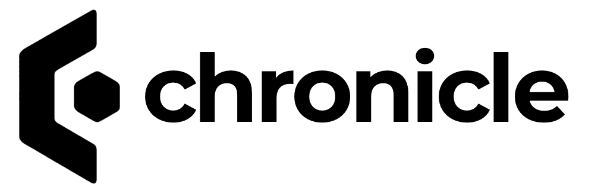

# Chronicle

## Event Sourcing database for .NET built on top of MongoDB

    

Cratis Chronicle is an Event Sourcing database built with ease of use, productivity, compliance and maintainability in mind.
It provides the core server, referred to as the **Kernel** with a .NET client SDK to access it and tooling built into it.

Although optimized for MongoDB, its extensible model provides extension points for other data stores.

Read the documentation on our site [https://cratis.io](https://cratis.io) for all the details.
All samples are available in our [Samples repo](https://github.com/cratis/samples).
For general guidance on the core values and principles we adhere to, read more [here](https://github.com/Cratis/.github/blob/main/profile/README.md).

## Support

If you need direct assistance beyond what we already do through our GitHub issues, we offer paid support through githelp, click the badge above for more details.

## Stats

## Opening in VSCode online

If you prefer to browse the code in VSCode, you can do so by clicking [here](https://vscode.dev/github/cratis/chronicle).

## Contributing / Running locally

If you're looking to either contribute or dive into the code by building and running the Cratis Chronicle locally,
you can read more [here](./Documentation/contributing.md). You'll find issues to start with by going to [here](https://github.com/cratis/chronicle/contribute).
