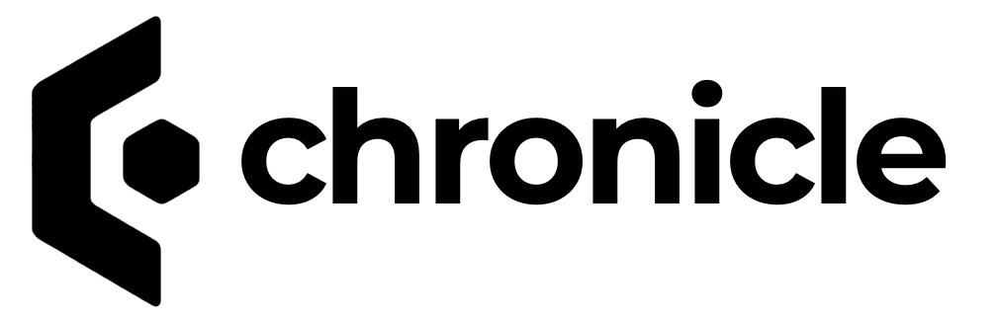

<div align="center">
  <a href="https://cratis.io">
    
  </a>

  <h3 align="center">Cratis Chronicle</h3>

  <p align="center">
    An Event Sourcing database for .NET — built with ease of use, productivity, compliance, and maintainability in mind.
    <br />
    <a href="https://cratis.io"><strong>Explore the docs »</strong></a>
    <br />
    <br />
    <a href="https://github.com/cratis/samples">View Samples</a>
    &nbsp;·&nbsp;
    <a href="https://github.com/cratis/chronicle/issues/new?labels=bug">Report a Bug</a>
    &nbsp;·&nbsp;
    <a href="https://github.com/cratis/chronicle/issues/new?labels=enhancement">Request a Feature</a>
    &nbsp;·&nbsp;
    <a href="https://discord.gg/kt4AMpV8WV">Join the Discord</a>
  </p>

  <p align="center">
    <a href="https://discord.gg/kt4AMpV8WV">
      
    </a>
    <a href="http://nuget.org/packages/cratis.chronicle">
      
    </a>
    <a href="https://hub.docker.com/r/cratis/chronicle">
      
    </a>
    <a href="https://github.com/Cratis/Chronicle/actions/workflows/dotnet-build.yml">
      
    </a>
    <a href="https://github.com/Cratis/Chronicle/actions/workflows/publish.yml">
      
    </a>
    <a href="https://github.com/Cratis/Documentation/actions/workflows/pages.yml">
      
    </a>
  </p>
</div>

---

## 📖 Table of Contents

- [About](#-about)
- [Key Features](#-key-features)
- [Getting Started](#-getting-started)
  - [Prerequisites](#prerequisites)
  - [Installation](#installation)
  - [Quick Example](#quick-example)
- [Architecture](#-architecture)
- [Documentation](#-documentation)
- [Contributing](#-contributing)
- [Support](#-support)
- [License](#-license)
- [Acknowledgements](#-acknowledgements)

---

## 🧭 About

Cratis Chronicle is an **Event Sourcing database** that captures every state change in your system as an immutable sequence of events — rather than storing only the current state.
This unlocks powerful capabilities like full audit trails, time-travel debugging, and event-driven architectures without the usual complexity.

Chronicle ships with:

- 🖥️ **Chronicle Kernel** — the server that manages event storage, processing, and querying
- 📦 **.NET Client SDK** — a rich C# library for interacting with Chronicle from any .NET application
- 🌐 **Web Workbench** — a built-in management dashboard for monitoring, browsing events, and administration
- 🗄️ **MongoDB Backend** — optimized storage layer with an extensible model for other data stores

> For core values and principles, read our [core values and principles](https://github.com/Cratis/.github/blob/main/profile/README.md).

---

## ✨ Key Features

### 🏗️ Event Sourcing Foundation

| | |
|---|---|
| **Immutable Event Store** | Every state change is persisted as an immutable event — nothing is ever overwritten |
| **Event Streams** | Organized per aggregate or entity, with full history preservation |
| **Schema Evolution** | Strongly-typed event definitions with support for evolving schemas over time |
| **Rich Metadata** | Timestamps, correlation IDs, causation IDs, and custom tags on every event |

### 🎯 Real-time Processing

| | |
|---|---|
| **Reactors** | React to events as they occur — ideal for side effects and *if-this-then-that* scenarios |
| **Reducers** | Imperatively transform events into typed read models, managed by Chronicle |
| **Projections** | Declarative, fluent read-model builders with join, set, and remove support |
| **Observers** | Low-level event subscriptions with guaranteed delivery |

### 🛡️ Enterprise Ready

| | |
|---|---|
| **Multi-tenancy** | First-class namespace support for isolated tenant data |
| **Constraints** | Server-side integrity rules enforced at append time |
| **Compliance** | Full audit trails and data lineage for regulatory requirements |
| **Compensation** | Built-in support for correcting past events |

### 🚀 Developer Experience

| | |
|---|---|
| **Convention-based** | Minimal configuration — artifacts are discovered automatically by naming convention |
| **DI Native** | First-class support for ASP.NET Core dependency injection |
| **Strong Typing** | End-to-end C# types from events through projections to read models |
| **Testing Utilities** | In-memory providers and test helpers for unit and integration testing |

---

## 🚀 Getting Started

### Prerequisites

- [.NET 8+](https://dotnet.microsoft.com/download)
- [Docker](https://www.docker.com/) (to run the Chronicle Kernel and MongoDB)

### Installation

**Run Chronicle and MongoDB with Docker Compose:**

```yaml
services:
  mongo:
    image: mongo:6
    ports:
      - "27017:27017"

  chronicle:
    image: cratis/chronicle:latest
    ports:
      - "35000:35000"   # gRPC / API
      - "8080:8080"     # Web Workbench
    environment:
      - CONNECTIONSTRINGS__EVENTSTORE=mongodb://mongo:27017
    depends_on:
      - mongo
```

```shell
docker compose up -d
```

**Add the NuGet package to your .NET project:**

```shell
# ASP.NET Core
dotnet add package Cratis.Chronicle.AspNetCore

# Console / Worker Service
dotnet add package Cratis.Chronicle
```

### Quick Example

#### ASP.NET Core setup (`Program.cs`)

```csharp
var builder = WebApplication.CreateBuilder(args)
    .AddCratisChronicle(options => options.EventStore = "MyApp");

var app = builder.Build();
app.UseCratisChronicle();
app.Run();
```

#### Define events

```csharp
[EventType]
public record UserOnboarded(string Name, string Email);

[EventType]
public record BookAddedToInventory(string Title, string Author, string ISBN);
```

#### Append events

```csharp
// Inject IEventLog or grab it from the event store
await eventLog.Append(Guid.NewGuid(), new UserOnboarded("Jane Doe", "jane@example.com"));
await eventLog.Append(Guid.NewGuid(), new BookAddedToInventory("Domain-Driven Design", "Eric Evans", "978-0321125217"));
```

#### React to events (Reactor)

```csharp
public class UserNotifier : IReactor
{
    public async Task Onboarded(UserOnboarded @event, EventContext context)
    {
        // send welcome email, provision resources, etc.
        Console.WriteLine($"Welcome, {@event.Name}!");
    }
}
```

#### Build read models (Reducer)

```csharp
public class BooksReducer : IReducerFor<Book>
{
    public Task<Book> Added(BookAddedToInventory @event, Book? current, EventContext context) =>
        Task.FromResult(new Book(
            Guid.Parse(context.EventSourceId),
            @event.Title,
            @event.Author,
            @event.ISBN));
}
```

#### Declarative projections

```csharp
public class BorrowedBooksProjection : IProjectionFor<BorrowedBook>
{
    public void Define(IProjectionBuilderFor<BorrowedBook> builder) => builder
        .From<BookBorrowed>(from => from
            .Set(m => m.UserId).To(e => e.UserId)
            .Set(m => m.Borrowed).ToEventContextProperty(c => c.Occurred))
        .Join<BookAddedToInventory>(b => b
            .On(m => m.Id)
            .Set(m => m.Title).To(e => e.Title))
        .RemovedWith<BookReturned>();
}
```

> **Full working samples** are available in the [Samples repository](https://github.com/cratis/samples).

---

## 🏛️ Architecture

```text
┌──────────────────────────────────────────────────────────┐
│                  Your .NET Application                   │
│                                                          │
│  ┌────────────────────────────────────────────────────┐  │
│  │  Events · Reactors · Reducers · Projections        │  │
│  └────────────────────────────────────────────────────┘  │
│                                                          │
│                   Chronicle Client SDK                   │
└─────────────────────────────┬────────────────────────────┘
                              │  gRPC
┌─────────────────────────────┴────────────────────────────┐
│                     Chronicle Kernel                     │
│                                                          │
│  ┌────────────────┐  ┌────────────────┐  ┌────────────┐  │
│  │  Event Store   │  │   Projection   │  │    Web     │  │
│  │   (MongoDB)    │  │   Engine       │  │ Workbench  │  │
│  └────────────────┘  └────────────────┘  └────────────┘  │
└──────────────────────────────────────────────────────────┘
```

Chronicle follows a **client-server** model:

| Component | Description |
|---|---|
| **Chronicle Kernel** | Server that manages event storage, observer dispatch, projection processing, and querying |
| **Client SDK** | .NET libraries (`Cratis.Chronicle` / `Cratis.Chronicle.AspNetCore`) that connect your app to the Kernel |
| **MongoDB Backend** | Default event and read-model storage; extensible to other providers |
| **Web Workbench** | Browser-based dashboard available at `http://localhost:8080` when running the development image |

---

## 📚 Documentation

Full documentation is available at **[https://cratis.io](https://cratis.io)**.

| Section | Description |
|---|---|
| [Get Started](https://cratis.io/get-started) | Quick-start guides for Console, Worker Service, and ASP.NET Core |
| [Concepts](https://cratis.io/concepts) | Events, projections, reactors, reducers, constraints, and more |
| [Hosting](https://cratis.io/hosting) | Production and development deployment options |
| [Configuration](https://cratis.io/configuration) | Client and server configuration reference |
| [Contributing](./Documentation/contributing/index.md) | How to build and contribute to Chronicle |

---

## 🤝 Contributing

Contributions are what make the open-source community an amazing place to learn, inspire, and create.
Any contribution you make is **greatly appreciated**!

1. Fork the repository
2. Create a feature branch: `git checkout -b feature/AmazingFeature`
3. Commit your changes: `git commit -m 'Add some AmazingFeature'`
4. Push to the branch: `git push origin feature/AmazingFeature`
5. Open a Pull Request

Looking for a good first issue? Check out the [contribute page](https://github.com/cratis/chronicle/contribute).

For detailed build and development instructions, see the [contributing guide](./Documentation/contributing/index.md).

You can also browse the code directly in your browser:
[](https://vscode.dev/github/cratis/chronicle)

---

## 💬 Support

| Channel | Details |
|---|---|
| 💬 **Discord** | Join the community on [Discord](https://discord.gg/kt4AMpV8WV) for questions and discussions |
| 🐛 **GitHub Issues** | [Report bugs or request features](https://github.com/cratis/chronicle/issues) |
| 💼 **Paid Support** | Need dedicated help? We offer paid support via [githelp](https://githelp.app/repos/cratis) |

[](https://githelp.app/repos/cratis)

---

## 📊 Repository Stats


---

## 📄 License

Distributed under the **MIT License**. See [`LICENSE`](./LICENSE) for full details.

---

## 🙏 Acknowledgements

- [MongoDB](https://www.mongodb.com/) — the default storage backend powering Chronicle
- [Microsoft Orleans](https://github.com/dotnet/orleans) — distributed actor framework used in the Chronicle Kernel
- [Louis3797/awesome-readme-template](https://github.com/Louis3797/awesome-readme-template) — README inspiration
- All our [contributors](https://github.com/cratis/chronicle/graphs/contributors) and the open-source community ❤️
