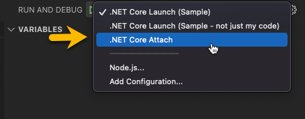

# ProxyGenerator

This project is responsible for generating TypeScript code from backend C# code, specifically for ASP.NET controllers and
any input and/or output types they use on their actions.

It leverages the Roslyn Source Generator capability, originally intended for generating C# code - but fits our needs as
to get called at the correct time during the compilation steps and then output TypeScript code to the configured locations.

More information about Source Generators can be found [here](https://docs.microsoft.com/en-us/dotnet/csharp/roslyn-sdk/source-generators-overview)
and also a full tutorial can be found [here](https://www.thinktecture.com/en/net/roslyn-source-generators-introduction/).
The [following article](https://dominikjeske.github.io/source-generators/) contains a lot more detail as well.

## Configuration Options

Configuration can also be part of analyzers and follow a convention, mentioned a little bit in the previous article - but also
more details [here](https://www.mytechramblings.com/posts/configure-roslyn-analyzers-using-editorconfig/).
The way we have opted in to do this is to leverage the build properties from MsBuild, the values are prefixed with **build_property** and
then the name of the property. The propertyname is lower cased.

The following property specified in a .csproj:

```xml
<PropertyGroup>
    <AksioProxyOutput>../Web</AksioProxyOutput>
</PropertyGroup>
```

Will be accessible through the global options on the `GeneratorExecutionContext`:

```csharp
context.AnalyzerConfigOptions.GlobalOptions.TryGetValue("build_property.aksioproxyoutput", out var outputFolder);
```

In addition to this to work, the property needs to be visible to the compiler - this is achieved by adding

```xml
<CompilerVisibleProperty Include="AksioProxyOutput"/>
```

Within an `<ItemGroup/>` in the [Aksio.Cratis.Applications.ProxyGenerator.props](./build/Aksio.Cratis.Applications.ProxyGenerator.props) file that will automatically
be included during compiletime of any consumers of this package.

## Run in sample

```shell
dotnet build --no-incremental
```

## Debugging

Debugging the compiler is not something that is typically not an out of the box experience.
If you're using regular Visual Studio 20xx, you can simply add a `Debugger.Launch()` statement in the code
where you want to debug and then run the build.

For VSCode, you have to wait for the debugger to attach to the correct process, add the following:

```csharp
while (!System.Diagnostics.Debugger.IsAttached) Thread.Sleep(10);
```

Then do a build from the project you're testing from:

```shell
dotnet build --no-incremental
```

You can then attach the debugger:



... and find the compiler process:


You will then hit any breakpoints in the generator code.
